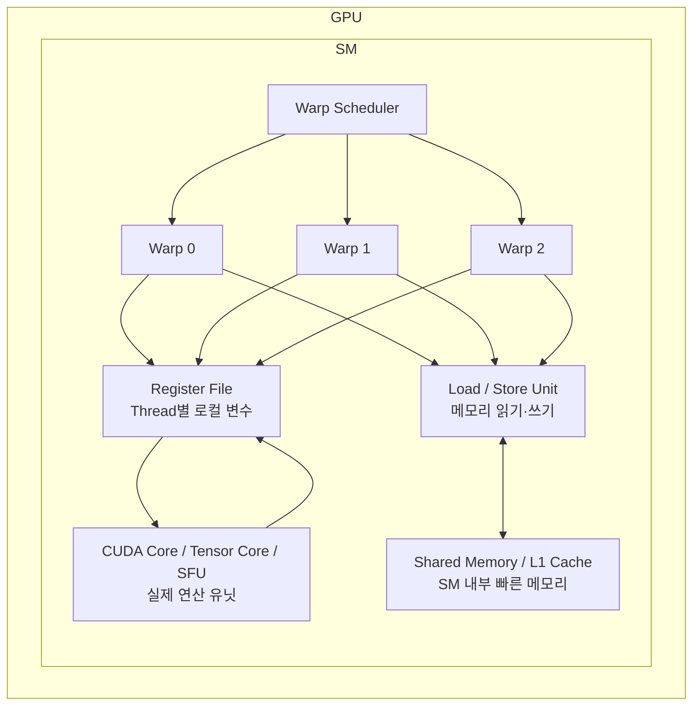

# SW 엔지니어를 위한 GPU 관련 내용 간단 정리 (NVIDIA GPU 기준)

## 목차

  - [1. GPU 벤더별 아키텍처 개요](#1-gpu-벤더별-아키텍처-개요)
  - [2. CUDA Kernel과 실행 계층: Kernel / Grid / Block / Thread](#2-cuda-kernel과-실행-계층-kernel--grid--block--thread)
    - [Kernel이란?](#kernel이란)
      - ["Kernel"이라는 이름의 유래](#kernel이라는-이름의-유래)
      - [PyTorch를 쓸 때 Kernel은 어디에 있나?](#pytorch를-쓸-때-kernel은-어디에-있나)
      - [Kernel Launch 오버헤드](#kernel-launch-오버헤드)
    - [기본 계층 구조](#기본-계층-구조)
    - [Grid / Block / Thread / Warp의 역할](#grid--block--thread--warp의-역할)
  - [3. SM 내부 구조: 실제 연산 단위들](#3-sm-내부-구조-실제-연산-단위들)
    - [SM 내부 구성 요소](#sm-내부-구성-요소)
    - [Tensor Core: 세대별 지원 범위](#tensor-core-세대별-지원-범위)
    - [Shared Memory와 L1 Cache의 관계](#shared-memory와-l1-cache의-관계)
    - [Grid / Block / Thread / Warp / SM의 역할](#grid--block--thread--warp--sm의-역할)
  - [4. GPU 메모리 계층 구조](#4-gpu-메모리-계층-구조)
    - [메모리 계층 전체 그림](#메모리-계층-전체-그림)
    - [SM 내부 구조와 메모리 계층 관계](#sm-내부-구조와-메모리-계층-관계)
    - [벤더/세대별 VRAM 대역폭 비교](#벤더세대별-vram-대역폭-비교)
    - [VRAM이 병목인 경우의 증상](#vram이-병목인-경우의-증상)
  - [5. SIMT vs SIMD: 헷갈리기 쉬운 개념 구분](#5-simt-vs-simd-헷갈리기-쉬운-개념-구분)
  - [6. Occupancy](#6-occupancy)
    - [Occupancy란?](#occupancy란)
    - [Occupancy를 제한하는 세 가지 요인](#occupancy를-제한하는-세-가지-요인)
    - [실제 진단 방법](#실제-진단-방법)
    - [Occupancy가 높다고 항상 빠른 건 아니다](#occupancy가-높다고-항상-빠른-건-아니다)
  - [7. Memory Coalescing: VRAM 대역폭을 제대로 쓰려면](#7-memory-coalescing-vram-대역폭을-제대로-쓰려면)
    - [Coalescing이란?](#coalescing이란)
    - [SW 엔지니어 관점의 적용 포인트](#sw-엔지니어-관점의-적용-포인트)
  - [8. Warp Divergence: 분기문이 GPU에서 느린 이유](#8-warp-divergence-분기문이-gpu에서-느린-이유)
    - [Divergence 최소화 전략](#divergence-최소화-전략)
  - [9. Kernel Fusion: 프레임워크가 자동으로 해주는 가장 중요한 최적화](#9-kernel-fusion-프레임워크가-자동으로-해주는-가장-중요한-최적화)
    - [Fusion이 왜 필요한가?](#fusion이-왜-필요한가)
    - [프레임워크별 Fusion 전략](#프레임워크별-fusion-전략)
    - [Flash Attention: Fusion의 대표 성공 사례](#flash-attention-fusion의-대표-성공-사례)
    - [SW 엔지니어 관점의 Fusion 전략](#sw-엔지니어-관점의-fusion-전략)
  - [10. Roofline Model: Compute Bound vs Memory Bound](#10-roofline-model-compute-bound-vs-memory-bound)
    - [핵심 개념: Arithmetic Intensity](#핵심-개념-arithmetic-intensity)
    - [판별 기준 (H100 예시)](#판별-기준-h100-예시)
    - [연산별 분류](#연산별-분류)
    - [SW 엔지니어의 활용 방법](#sw-엔지니어의-활용-방법)
  - [11. CUDA Stream과 비동기 실행 패턴](#11-cuda-stream과-비동기-실행-패턴)
    - [Default Stream의 함정](#default-stream의-함정)
    - [실용적인 Multi-Stream 패턴](#실용적인-multi-stream-패턴)
    - [CUDA Event: Stream 간 정밀 동기화](#cuda-event-stream-간-정밀-동기화)
  - [12. Multi-GPU 실행: NCCL과 병렬화 전략](#12-multi-gpu-실행-nccl과-병렬화-전략)
    - [NCCL이란?](#nccl이란)
    - [병렬화 전략 비교](#병렬화-전략-비교)
    - [실제 Multi-GPU 서빙에서의 적용](#실제-multi-gpu-서빙에서의-적용)
    - [GPU 간 통신 병목 진단](#gpu-간-통신-병목-진단)
  - [13. MPS vs MIG: 멀티 테넌트 서빙 설계](#13-mps-vs-mig-멀티-테넌트-서빙-설계)
    - [MPS (Multi-Process Service)](#mps-multi-process-service)
    - [MIG (Multi-Instance GPU)](#mig-multi-instance-gpu)
    - [선택 기준 정리](#선택-기준-정리)
  - [14. GPU 프로파일링 도구](#14-gpu-프로파일링-도구)
    - [도구 계층별 정리](#도구-계층별-정리)
    - [진단 워크플로우](#진단-워크플로우)
  - [15. 프레임워크별 GPU 추상화 계층](#15-프레임워크별-gpu-추상화-계층)
    - [전체 소프트웨어 스택](#전체-소프트웨어-스택)
    - [PyTorch의 CUDA Memory Allocator 이해](#pytorch의-cuda-memory-allocator-이해)
    - [추론 최적화 선택 기준](#추론-최적화-선택-기준)
  - [16. 최종 정리: SW 엔지니어 관점의 판단 기준](#16-최종-정리-sw-엔지니어-관점의-판단-기준)
    - [GPU 성능 문제 진단 체크리스트](#gpu-성능-문제-진단-체크리스트)
    - [핵심 개념 최종 요약](#핵심-개념-최종-요약)

---

## 1. GPU 벤더별 아키텍처 개요

시작하기에 앞서 밑 내용은 **NVIDIA GPU 기준**으로 작성되었음을 알려드립니다.
NVIDIA GPU를 포함한 주요 벤더사들의 아케턱처는 다음과 같이 간략하게 요약해두었습니다.

| 항목 | NVIDIA | AMD | Intel |
|---|---|---|---|
| 연산 유닛 이름 | CUDA Core / Tensor Core | Stream Processor / Matrix Core | Xe Core / XMX Engine |
| 병렬 실행 단위 | Warp (32 Threads) | Wavefront (64 Threads) | SIMD Lane (8~16) |
| GPU 클러스터 단위 | SM (Streaming Multiprocessor) | CU (Compute Unit) | Xe-core |
| 프로그래밍 모델 | CUDA | ROCm / HIP | oneAPI / SYCL |
| 딥러닝 지원 | cuDNN, TensorRT | MIOpen, ROCm | OpenVINO, IPEX |
| 주요 강점 | 생태계, 소프트웨어 성숙도 | 가성비, 오픈소스 친화 | CPU+GPU 통합(iGPU) |

</br>

## 2. CUDA Kernel과 실행 계층: Kernel / Grid / Block / Thread

### Kernel이란?

GPU에서 Kernel은 GPU의 수많은 Thread들이 **각자 동시에 실행하는 함수**를 의미한다.

CPU에서 일반 함수를 호출하면 다음과 같이 하나의 Thread가 한 번 실행한다.

```python
def add(a, b):
    return a + b

result = add(1, 2)  # CPU Thread 1개가 순서대로 1번 실행
```

하지만, GPU Kernel을 호출하면 수천~수만 개의 Thread가 **동일한 함수를 동시에** 실행한다.

```c
// __global__ 키워드 = "이 함수는 GPU에서 실행된다"는 선언
__global__ void add(float* A, float* B, float* C) {
    int i = threadIdx.x;  // 각 Thread가 자신의 고유 인덱스를 가져옴
    C[i] = A[i] + B[i];  // 코드는 같지만 각자 다른 데이터를 처리
}

// <<<1, 1024>>> = "Block 1개, 각 Block에 Thread 1024개로 실행"
add<<<1, 1024>>>(A, B, C);
```

```text
실행 결과:
Thread 0    → C[0]    = A[0]    + B[0]
Thread 1    → C[1]    = A[1]    + B[1]
Thread 2    → C[2]    = A[2]    + B[2]
...
Thread 1023 → C[1023] = A[1023] + B[1023]

코드(함수)는 하나지만, 실행은 1024번 동시에 일어난다.
```

#### "Kernel"이라는 이름의 유래

OS의 커널(Kernel)과는 **전혀 다른 개념**이다. GPU에서 Kernel이라는 이름은 수학/통계에서 왔다. 통계에서 Kernel은 "모든 데이터 포인트에 동일하게 적용되는 함수"를 뜻한다(ex. SVM Kernel, Gaussian Kernel). GPU Kernel도 같은 어원으로, **"전체 데이터에 동일하게 적용하는 연산 단위"** 다.

#### PyTorch를 쓸 때 Kernel은 어디에 있나?

Python 레벨에서는 직접 보이지 않지만, 연산자를 호출할 때마다 내부적으로 Kernel이 실행된다.

```python
x = torch.randn(1024, 1024).cuda()
y = torch.randn(1024, 1024).cuda()

z = x + y          # ← elementwise_add Kernel 호출
z = torch.relu(z)  # ← relu Kernel 호출
z = x @ y          # ← gemm (행렬곱) Kernel 호출
```

```text
즉, PyTorch 연산자 1개 (ex. x + y) = cuDNN/cuBLAS의 CUDA Kernel 1개 또는 여러 개
```

PyTorch Profiler로 실제로 확인할 수 있다.

```python
with torch.profiler.profile(activities=[torch.profiler.ProfilerActivity.CUDA]) as prof:
    z = x + y

print(prof.key_averages().table())
# 출력 예시:
# Name                         CUDA time
# void elementwise_add_cuda    0.12ms
# sm80_xmma_gemm_f32f32_...    1.84ms
```

#### Kernel Launch 오버헤드

Kernel을 GPU에 제출하는 것 자체도 CPU 측에서 약 **수 μs~수십 μs**의 비용이 든다. 연산이 매우 작은 Kernel을 수천 번 호출하면 이 오버헤드가 실제 연산 시간보다 커질 수 있다. 이것이 Kernel Fusion(Section 9)이 중요한 이유 중 하나다.

```text
나쁜 패턴:
  for _ in range(1000):
      small_op(x)   # Kernel 1000번 Launch → 오버헤드 누적

좋은 패턴:
  fused_op(x)       # 1번의 Kernel Launch로 동일한 연산 처리
```

---

### 기본 계층 구조

Kernel이 실행되면 Thread들이 계층적으로 만들어진다.

```text
Kernel Launch
└── Grid (전체 실행 공간)
    ├── Block (0, 0)
    │   ├── Thread (0, 0), Thread (1, 0), ...
    │   └── Warp 단위로 묶여 SM에서 실행됨
    ├── Block (1, 0)
    └── Block (N, M)
```

### Grid / Block / Thread / Warp의 역할

CUDA Kernel이 실행되면 GPU는 전체 작업을 `Grid → Block → Thread` 계층으로 나누어 처리한다.

```text
Grid  = Kernel 하나가 처리할 전체 문제 공간
Block = 전체 문제를 여러 조각으로 나눈 작업 묶음
Thread = 실제 데이터 하나 또는 일부를 처리하는 실행 단위
Warp = Thread 32개가 실제로 묶여 실행되는 단위
```

예를 들어 길이 1,000,000짜리 배열을 더하는 Kernel을 실행한다고 하면, Grid는 전체 배열 1,000,000개 원소를 처리하는 실행 공간이다. 이 전체 작업을 여러 Block으로 나누고, 각 Block 안의 Thread들이 실제 원소를 하나씩 처리한다.

```text
Grid
├── Block 0 → 원소 0 ~ 255 처리
├── Block 1 → 원소 256 ~ 511 처리
├── Block 2 → 원소 512 ~ 767 처리
└── ...
```

CUDA 코드에서는 보통 다음과 같이 Grid 크기와 Block 크기를 지정한다.

```c
int threadsPerBlock = 256;
int blocksPerGrid = (N + threadsPerBlock - 1) / threadsPerBlock;

add<<<blocksPerGrid, threadsPerBlock>>>(A, B, C, N);
```

여기서 `threadsPerBlock`은 Block 하나에 들어갈 Thread 수이고, `blocksPerGrid`는 Grid 안에 생성할 Block 수다.

즉 다음 코드는:

```c
add<<<3907, 256>>>(A, B, C, N);
```

아래와 같은 의미다.

```text
Grid 안에 Block 3907개를 만들고,
각 Block은 Thread 256개를 가진다.
각 Thread는 배열의 원소 하나 또는 일부를 처리한다.
```

그리고 NVIDIA GPU에서는 Thread들이 실제로는 32개 단위의 Warp로 묶여 실행된다.

```text
Block 1개 = Thread 256개
Thread 256개 = Warp 8개
```

정리하면, Grid는 전체 작업 범위를 표현하는 단위이고, Block은 그 작업을 GPU가 나누어 처리하기 위한 작업 묶음이며, Thread는 실제 데이터를 처리하는 논리적 실행 단위다. Warp는 하드웨어가 Thread들을 실제로 실행할 때 사용하는 32개 Thread 단위의 실행 묶음이다.


---

## 3. SM 내부 구조: 실제 연산 단위들

SM(Streaming Multiprocessor)은 GPU 내부의 실제 연산 작업장이다. 구성 요소를 이해하면 어떤 연산이 어디서 실행되는지 알 수 있다.

### SM 내부 구성 요소

| 구성 요소 | 역할 | SW 엔지니어 관련 포인트 |
|---|---|---|
| CUDA Core | 부동소수점/정수 연산 | FP32, FP64, INT32 연산 처리 |
| Tensor Core | 행렬 곱셈 가속 | 딥러닝 핵심. FP16/BF16/INT8/FP8 지원 |
| SFU | sin/cos/exp/log/rsqrt 등 초월함수 | Sigmoid/GELU/Softmax의 내부 연산 처리 |
| Warp Scheduler | 실행할 Warp 선택 | 메모리 지연 은닉의 핵심 |
| Register File | Thread별 로컬 변수 저장 | Occupancy에 직접 영향 |
| Shared Memory | Block 내 Thread 간 공유 메모리 | L1 Cache와 물리적으로 같은 SRAM 공유 |
| Load/Store Unit | VRAM ↔ Cache 간 데이터 이동 | 메모리 대역폭 활용률에 영향 |

### Tensor Core: 세대별 지원 범위

> **중요**: Tensor Core는 모든 GPU에 있는 게 아니다.

```text
Volta (V100, 2017):    Tensor Core 최초 도입. FP16 지원
Turing (T4, 2018):     INT8, INT4 추가. 추론용으로 강화
Ampere (A100, 2020):   BF16, TF32, FP64 Tensor Core 추가
                       Sparse 연산 2x 가속 (구조적 희소성)
Hopper (H100, 2022):   FP8 추가. Transformer Engine 도입
                       NVLink 4세대, HBM3
Ada (RTX 40xx, 2022):  FP8, 소비자용 Tensor Core

AMD CDNA2 (MI250, 2021): Matrix Core 도입 (NVIDIA Tensor Core 대응)
```

```text
SW 적용 포인트:
- 구형 GPU(Pascal, Maxwell)에서 BF16/FP8을 쓰면 Tensor Core가 없어
  CUDA Core로 폴백되어 성능이 크게 떨어진다.
- PyTorch의 torch.backends.cuda.matmul.allow_tf32 등 설정은
  Tensor Core 활성화 여부를 제어한다.
- TensorRT의 precision 모드 선택(FP16/INT8)도 실제로는
  어떤 Tensor Core variant를 쓸지 결정하는 것이다.
```

### Shared Memory와 L1 Cache의 관계

```text
Kepler 이후 세대부터 Shared Memory와 L1 Cache는
물리적으로 동일한 SRAM을 공유한다.

Ampere 기준:
  - 총 SRAM: 192KB per SM
  - Shared Memory 최대: 164KB
  - 나머지가 L1 Cache로 동작

비율 조정 방법 (CUDA):
  cudaFuncSetAttribute(kernel, cudaFuncAttributeMaxDynamicSharedMemorySize, size);

→ 대용량 행렬 연산처럼 재사용이 많은 경우 Shared Memory를 크게,
  단순 스트리밍 연산처럼 재사용이 없는 경우 L1을 크게 설정하는 것이 유리하다.
```

### Grid / Block / Thread / Warp / SM의 역할

CUDA Kernel이 실행되면 GPU는 전체 작업을 `Grid → Block → Thread` 계층으로 나누어 처리한다.

```text id="o8n7rl"
Grid  = Kernel 하나가 처리할 전체 문제 공간
Block = 전체 문제를 여러 조각으로 나눈 작업 묶음
Thread = 실제 데이터 하나 또는 일부를 처리하는 실행 단위
Warp = Thread 32개가 실제로 묶여 실행되는 단위
SM = Block이 배치되어 실제로 실행되는 GPU 내부 연산 유닛
```

예를 들어 길이 1,000,000짜리 배열을 더하는 Kernel을 실행한다고 하면, Grid는 전체 배열 1,000,000개 원소를 처리하는 실행 공간이다. 이 전체 작업을 여러 Block으로 나누고, 각 Block 안의 Thread들이 실제 원소를 하나씩 처리한다.

```text id="ja5l1b"
Grid
├── Block 0 → 원소 0 ~ 255 처리
├── Block 1 → 원소 256 ~ 511 처리
├── Block 2 → 원소 512 ~ 767 처리
└── ...
```

CUDA 코드에서는 보통 다음과 같이 Grid 크기와 Block 크기를 지정한다.

```c id="tj85q8"
int threadsPerBlock = 256;
int blocksPerGrid = (N + threadsPerBlock - 1) / threadsPerBlock;

add<<<blocksPerGrid, threadsPerBlock>>>(A, B, C, N);
```

여기서 `threadsPerBlock`은 Block 하나에 들어갈 Thread 수이고, `blocksPerGrid`는 Grid 안에 생성할 Block 수다.

즉 다음 코드는:

```c id="v73b9a"
add<<<3907, 256>>>(A, B, C, N);
```

아래와 같은 의미다.

```text id="x1732e"
Grid 안에 Block 3907개를 만들고,
각 Block은 Thread 256개를 가진다.
각 Thread는 배열의 원소 하나 또는 일부를 처리한다.
```

GPU는 이 Grid 전체를 한 번에 실행하는 것이 아니라, Grid 안의 Block들을 여러 SM에 나누어 배치한다.

```text id="smx7i4"
GPU
├── SM 0 ← Block 0, Block 4, Block 8 ...
├── SM 1 ← Block 1, Block 5, Block 9 ...
├── SM 2 ← Block 2, Block 6, Block 10 ...
└── SM 3 ← Block 3, Block 7, Block 11 ...
```

즉, **Grid는 전체 작업의 논리적 범위**이고, **Block은 SM에 배치되는 작업 단위**다. 하나의 SM에는 자원이 허용하는 범위 안에서 여러 Block이 동시에 올라갈 수 있다.

그리고 Block 안의 Thread들은 실제로는 32개 단위의 Warp로 묶여 실행된다.

```text id="hy6pwo"
Block 1개 = Thread 256개
Thread 256개 = Warp 8개
```

SM 내부에서는 이 Warp들이 실제 실행 단위가 된다. 즉, SM은 Block을 배치받고, 그 Block 안의 Thread들을 Warp 단위로 실행한다.

```text id="mb9qwm"
SM
├── Block 0
│   ├── Warp 0
│   ├── Warp 1
│   ├── Warp 2
│   └── Warp 3
└── Block 1
    ├── Warp 4
    ├── Warp 5
    ├── Warp 6
    └── Warp 7
```

정리하면 다음과 같다.

```text id="o9h71v"
Grid는 Kernel이 처리할 전체 문제 공간이다.
Block은 전체 문제를 SM에 배치하기 좋게 나눈 작업 묶음이다.
Thread는 실제 데이터 하나 또는 일부를 처리하는 논리적 실행 단위다.
Warp는 Thread 32개가 묶인 실제 실행 단위다.
SM은 Block이 배치되고 Warp들이 실제로 실행되는 GPU 내부 연산 유닛이다.
```

따라서 CUDA 프로그래밍에서 Grid와 Block 크기를 정한다는 것은, 전체 데이터를 몇 개의 작업 묶음으로 나누고, 각 작업 묶음을 GPU의 여러 SM이 효율적으로 가져가 실행할 수 있도록 설계하는 것이다.


---

## 4. GPU 메모리 계층 구조

메모리 계층을 이해하면 "왜 이 연산이 느린가"를 진단할 수 있다.

### 메모리 계층 전체 그림

```text
빠름 ↑ / 작음 ↑
─────────────────────────────────────────────────────────
Register File       Thread당 수십~수백 개
                    → 가장 빠름. 다른 Thread와 공유 불가
─────────────────────────────────────────────────────────
Shared Memory       Block당 수십 KB (최대 164KB on Ampere)
/ L1 Cache          → 같은 Block의 Thread끼리 공유
                    → VRAM보다 수십 배 빠름
─────────────────────────────────────────────────────────
L2 Cache            GPU 전체가 공유 (수 MB 수준)
                    → SM 간 데이터 재사용에 유리
─────────────────────────────────────────────────────────
VRAM (HBM/GDDR)     수 GB ~ 수십 GB
                    → 실제 모델 가중치, 텐서 저장 공간
─────────────────────────────────────────────────────────
느림 ↓ / 큼 ↓
```


### SM 내부 구조와 메모리 계층 관계

SM은 GPU 내부의 실제 연산 작업장이다. Grid 안의 Block들은 여러 SM에 배치되고, Block 안의 Thread들은 Warp 단위로 묶여 SM 내부에서 실행된다.



위 구조를 실행 흐름으로 보면 다음과 같다.

```text
1. Grid 안의 Block들이 여러 SM에 배치된다.
2. SM에 배치된 Block의 Thread들은 32개 단위 Warp로 묶인다.
3. Warp Scheduler가 실행 가능한 Warp를 선택한다.
4. 각 Thread의 로컬 변수는 Register File에 저장된다.
5. 연산은 CUDA Core, Tensor Core, SFU 같은 연산 유닛에서 수행된다.
6. 메모리 접근이 필요하면 Load/Store Unit을 통해 Shared Memory, L1, L2, VRAM에 접근한다.
```

---

### 벤더/세대별 VRAM 대역폭 비교

```text
CPU DDR5 (2채널):    ~100 GB/s
NVIDIA RTX 4090:     ~1,008 GB/s   (GDDR6X)
NVIDIA A100 80GB:    ~2,000 GB/s   (HBM2e)
NVIDIA H100 80GB:    ~3,350 GB/s   (HBM3)
AMD MI300X:          ~5,300 GB/s   (HBM3)

→ H100은 CPU 대비 메모리 대역폭이 약 30배 이상이다.
  딥러닝 추론이 CPU보다 GPU에서 빠른 이유 중 하나가 여기 있다.
```

### VRAM이 병목인 경우의 증상

VRAM 병목은 연산 유닛이 부족해서 느린 것이 아니라, **SM이 필요한 데이터를 VRAM에서 가져오느라 대기하는 시간이 길어지는 상황**을 의미한다.

| 항목    | 내용                                                                                        |
| ----- | ----------------------------------------------------------------------------------------- |
| 대표 증상 | GPU-Util은 높게 보이지만 실제 FLOPS 효율이 낮음                                                         |
| 주요 원인 | 큰 텐서를 반복적으로 읽고 쓰는 연산                                                                      |
| 대표 연산 | LayerNorm, Softmax, Attention, Embedding Lookup 등                                         |
| 진단 방법 | `nvidia-smi dmon`, PyTorch Profiler, Nsight Systems, Nsight Compute 등으로 메모리 대역폭과 대기 시간 확인 |

예를 들어 LayerNorm이나 Softmax처럼 큰 텐서를 읽고 간단한 연산을 수행한 뒤 다시 VRAM에 쓰는 연산은 연산량에 비해 메모리 접근량이 많다. 이런 경우 GPU의 연산 유닛은 충분히 남아 있어도, 데이터를 가져오는 시간이 길어져 전체 성능이 VRAM 대역폭에 의해 제한될 수 있다.

```text
VRAM 병목이 발생하는 전형적인 패턴

VRAM에서 큰 텐서 읽기
→ 간단한 연산 수행
→ 결과를 다시 VRAM에 저장
→ 다음 Kernel에서 다시 VRAM에서 읽기
```

대책은 VRAM 접근 횟수를 줄이거나, 한 번 읽어온 데이터를 더 가까운 메모리 계층에서 재사용하는 것이다.

```text
1. Kernel Fusion
   여러 Kernel을 하나로 합쳐 중간 결과를 VRAM에 반복 저장하지 않도록 한다.
   예: LayerNorm + Activation + Linear를 하나의 Fused Kernel로 처리

2. Flash Attention
   Attention 중간 결과를 VRAM에 저장하지 않고,
   Shared Memory와 Register를 활용해 Attention 연산을 처리한다.
   → VRAM 접근 횟수와 메모리 사용량을 크게 줄일 수 있다.

3. Mixed Precision
   FP32 대신 FP16/BF16을 사용해 텐서 크기를 줄인다.
   → 같은 VRAM 대역폭으로 더 많은 데이터를 처리할 수 있다.

4. Activation Checkpointing
   학습 시 순전파 중간 Activation을 모두 저장하지 않고,
   역전파 시 필요한 값을 다시 계산한다.
   → VRAM 사용량은 줄지만, 재계산 비용 때문에 속도는 일부 희생될 수 있다.
```

정리하면, VRAM 병목은 “GPU가 연산을 못 해서 느린 상황”이라기보다, **연산 유닛이 데이터를 기다리느라 충분히 활용되지 못하는 상황**이다. 따라서 최적화 방향은 VRAM 접근을 줄이고, Register / Shared Memory / Cache에서 데이터 재사용을 늘리는 것이다.


---

## 5. SIMT vs SIMD: 헷갈리기 쉬운 개념 구분

GPU를 "SIMD 머신"이라고 부르는 경우도 있는데, 정확히는 **SIMT**다.

```text
SIMD (Single Instruction, Multiple Data):
  - CPU의 벡터 확장 명령(AVX-512 등)
  - 모든 레인이 동일한 명령어를 동시에 실행
  - 분기(if/else) 불가능. 레인마다 다른 경로 실행 자체가 안 됨
  - 레인 수가 적음 (AVX-512 기준 16개 FP32)

SIMT (Single Instruction, Multiple Threads):
  - NVIDIA GPU의 Warp 실행 방식
  - 각 Thread가 독립적인 Program Counter와 Register File을 가짐
  - 분기는 가능 (단 Warp Divergence 발생 → Section 8 참조)
  - 동시에 수천~수만 Thread 실행 가능
```

---

## 6. Occupancy

### Occupancy란?

```text
Occupancy = SM에서 실제 활성화된 Warp 수 / SM의 최대 동시 Warp 수

예시 (A100 기준):
  SM 최대 동시 Warp: 64개
  실제 활성 Warp: 32개
  → Occupancy = 50%
```

Occupancy가 중요한 이유는 **메모리 지연을 숨기는 데 필요한 Warp 풀**과 직결되기 때문이다.

```text
Warp가 메모리 대기 상태일 때:
  Warp Scheduler가 다른 활성 Warp로 전환 → SM이 쉬지 않음

Warp가 부족하면 (낮은 Occupancy):
  전환할 Warp가 없어서 SM이 대기 → 성능 저하
```

### Occupancy를 제한하는 세 가지 요인

```text
1. Register 사용량
   Thread당 레지스터를 많이 쓸수록
   한 SM에 올릴 수 있는 Thread 수가 줄어든다.
   
   예) SM 총 레지스터: 65,536개
       Thread당 레지스터 사용: 64개
       → 최대 Thread 수: 65,536 / 64 = 1,024개 = 32 Warp

2. Shared Memory 사용량
   Block당 Shared Memory를 많이 잡으면
   SM에 올릴 수 있는 Block 수가 줄어든다.
   
   예) SM Shared Memory: 96KB
       Block당 Shared Memory: 48KB
       → 동시에 2 Block만 상주 가능

3. Block당 Thread 수
   Block을 너무 작게 만들면 Block 수 제한에 걸리고,
   너무 크게 만들면 레지스터/Shared Memory 제한에 걸린다.
```

### 실제 진단 방법

```bash
# CUDA 제공 툴로 Occupancy 이론치 확인
# Python에서는:
from torch.cuda import utilization
# 또는 Nsight Compute 사용

# nvcc 컴파일 시 --ptxas-options=-v 옵션으로 레지스터 사용량 확인
nvcc --ptxas-options=-v kernel.cu
```

### Occupancy가 높다고 항상 빠른 건 아니다

```text
핵심 포인트:
  Occupancy 100%가 목표가 아니다.
  
  Compute Bound 커널: Occupancy가 50%여도 충분히 빠를 수 있다.
                      SM이 항상 연산 중이기 때문.
  Memory Bound 커널: Occupancy가 높아야 지연을 숨길 수 있다.

→ 커널의 성격(Compute Bound vs Memory Bound)을 먼저 파악해야 한다.
  (Section 10의 Roofline Model 참조)
```

---

## 7. Memory Coalescing: VRAM 대역폭을 제대로 쓰려면

### Coalescing이란?

같은 Warp의 32개 Thread가 VRAM에 접근할 때, 접근 주소가 **연속적으로 정렬되어 있으면** GPU 메모리 컨트롤러가 한 번의 트랜잭션으로 묶어서 처리할 수 있다.

```text
[Coalesced 접근 - 효율적]
Thread 0 → addr 0
Thread 1 → addr 4
Thread 2 → addr 8
...
Thread 31 → addr 124
→ 1번의 메모리 트랜잭션으로 처리 가능

[Strided 접근 - 비효율적]
Thread 0 → addr 0
Thread 1 → addr 128
Thread 2 → addr 256
...
Thread 31 → addr 3968
→ 32번의 개별 트랜잭션이 필요할 수 있음 → 대역폭 낭비
```

### SW 엔지니어 관점의 적용 포인트

```python
# PyTorch에서 contiguous() 호출이 중요한 이유
x = tensor.permute(0, 2, 1)          # 논리적으로만 전치됨 (stride 변경)
x_cont = tensor.permute(0, 2, 1).contiguous()  # 실제 메모리를 재배치

# contiguous하지 않은 텐서를 커널에 넘기면 내부적으로 비연속 접근 발생
# → VRAM 대역폭 효율 저하
```

```text
딥러닝에서 Coalescing 관련 실수 사례:
  - Embedding 테이블에서 임의 인덱스로 lookup 시 분산 접근 → 느림
  - Batch 데이터를 Column-Major로 저장 후 Row-Major 접근 → 느림
  - Attention에서 비표준 헤드 레이아웃 사용 → 느림
```

---

## 8. Warp Divergence: 분기문이 GPU에서 느린 이유

같은 Warp의 Thread들이 `if/else`로 다른 경로를 탈 때 발생한다.

```text
[Divergence 발생 시 실행 순서]

Warp 내 Thread:  T0  T1  T2  T3  T4  T5  T6  T7 ...
분기 결과:        if  if  else if  else if  else else ...

Step 1: if 경로 실행
  활성 Thread:  T0  T1  ──  T3  ──  T5  ──  ── ...
  비활성(마스킹): ──  ──  T2  ──  T4  ──  T6  T7 ...

Step 2: else 경로 실행
  활성 Thread:  ──  ──  T2  ──  T4  ──  T6  T7 ...
  비활성:       T0  T1  ──  T3  ──  T5  ──  ── ...

→ 전체 실행 시간 = if 경로 시간 + else 경로 시간
  SIMD처럼 둘을 동시에 실행하는 게 아니라 직렬로 처리됨
```

### Divergence 최소화 전략

```text
1. 데이터 타입별로 Batch를 나눠 처리
   - ex) 긴 시퀀스 / 짧은 시퀀스를 섞으면 padding이 늘고 Divergence 증가
   - → 비슷한 길이끼리 묶는 Dynamic Batching, Bucket Batching

2. 조건부 실행을 Mask 연산으로 대체
   y = (x > 0) * (x * 2) + (x <= 0) * (x - 1)
   → if/else 없이 Mask 곱셈으로 처리

3. Triton / CUDA 커널 직접 작성 시
   warp-uniform 조건(모든 Thread가 동일한 분기 결과)인지 확인
```

---

## 9. Kernel Fusion: 프레임워크가 자동으로 해주는 가장 중요한 최적화

### Fusion이 왜 필요한가?

딥러닝 모델의 한 레이어 추론은 실제로 여러 Kernel 호출의 연속이다.

```text
LayerNorm + GeLU + Linear 순서로 실행할 때:

[Fusion 없이]
VRAM → Kernel1(LayerNorm) → VRAM
VRAM → Kernel2(GeLU)      → VRAM
VRAM → Kernel3(Linear)    → VRAM

→ VRAM 읽기/쓰기를 6번 함

[Kernel Fusion 적용]
VRAM → FusedKernel(LayerNorm + GeLU + Linear) → VRAM

→ VRAM 읽기/쓰기를 2번으로 줄임
→ 중간 결과를 Shared Memory나 레지스터에서 바로 다음 연산으로 전달
```

### 프레임워크별 Fusion 전략

```text
TensorRT:
  ONNX 모델을 받아 Layer Fusion, Precision 변환, Kernel 선택을 자동으로 수행
  - Convolution + BN + ReLU → 단일 Fused Kernel
  - GEMM + Bias + Activation → 단일 Fused Kernel
  - Implicit GEMM: Im2Col 없이 Convolution 직접 수행
  사용:
    import tensorrt as trt
    builder = trt.Builder(logger)
    config = builder.create_builder_config()
    config.set_flag(trt.BuilderFlag.FP16)  # FP16 Tensor Core 활성화

torch.compile (PyTorch 2.0+):
  JIT 방식으로 Python 실행 그래프를 분석하여 Fusion 적용
  내부적으로 TorchInductor → Triton Kernel 생성
  사용:
    model = torch.compile(model, backend="inductor")
    # 또는 mode 선택
    model = torch.compile(model, mode="max-autotune")

XLA (JAX / TensorFlow):
  정적 계산 그래프를 분석하여 Fusion 적용
  JAX:
    @jax.jit
    def forward(x):
        return model(x)  # 첫 호출 시 XLA 컴파일 + Fusion

Triton (OpenAI):
  Python으로 직접 Fused Kernel을 작성할 수 있는 DSL
  Flash Attention이 Triton으로 구현됨
  사용:
    @triton.jit
    def fused_kernel(X, Y, Z, ...):
        ...

ONNX Runtime:
  그래프 최적화 레벨 설정으로 Fusion 제어
  sess_options = ort.SessionOptions()
  sess_options.graph_optimization_level = ort.GraphOptimizationLevel.ORT_ENABLE_ALL
```

### Flash Attention: Fusion의 대표 성공 사례

```text
기존 Attention:
  Q·K^T → VRAM 저장 → Softmax → VRAM 저장 → ·V → VRAM 저장
  → 시퀀스 길이 N에 대해 O(N²) VRAM 사용

Flash Attention (Dao et al., 2022):
  Q·K^T → (Shared Memory 내에서 즉시) Softmax → ·V
  → VRAM에 중간 결과 저장 안 함
  → VRAM 사용량 O(N)으로 감소
  → 실제 벽시계 시간도 2~4x 빨라짐

Flash Attention 2 / 3 (2023~):
  Warp-level 병렬화 추가, H100 Tensor Core 최적화 반영
```

### SW 엔지니어 관점의 Fusion 전략

```text
자동 Fusion이 잘 되는 경우:
  - 정적 형태(shape)의 단순 MLP
  - Transformer 표준 구조
  - TensorRT로 ONNX Export 가능한 모델

자동 Fusion이 어려운 경우:
  - 동적 shape (가변 길이 시퀀스, 조건부 경로)
  - 커스텀 Python 연산이 중간에 끼어 있는 경우
  - Control flow가 복잡한 경우

수동 개입 옵션:
  - torch.compile의 fullgraph=True로 Fusion 범위 강제
  - Triton으로 직접 Fused Kernel 작성
  - 모델 구조를 Fusion 친화적으로 리팩토링
```

---

## 10. Roofline Model: Compute Bound vs Memory Bound

GPU 커널의 성능 병목이 **연산 능력**인지 **메모리 대역폭**인지 판별하는 프레임워크다.

### 핵심 개념: Arithmetic Intensity

```text
Arithmetic Intensity (AI) = 수행한 FLOP / 접근한 메모리 바이트

예시:
  행렬 곱 C = A · B (M×N×K)
    FLOP: 2MNK
    메모리: (MK + KN + MN) × sizeof(float)
    → AI ↑ (행렬이 클수록 높아짐)

  Vector Add C = A + B
    FLOP: N
    메모리: 3N × sizeof(float)
    → AI ≈ 0.08 (매우 낮음 → Memory Bound)
```

### 판별 기준 (H100 예시)

```text
H100 스펙:
  FP16 Tensor Core: ~1,979 TFLOPS
  HBM3 대역폭:      ~3,350 GB/s
  Ridge Point(교점): 1,979 × 10¹² / (3,350 × 10⁹) ≈ 591 FLOP/Byte

AI < 591  → Memory Bound  (대역폭이 병목)
AI > 591  → Compute Bound (연산 능력이 병목)
```

### 연산별 분류

```text
Memory Bound (AI가 낮음):
  LayerNorm, BatchNorm, ReLU, Softmax, Embedding Lookup
  → 데이터를 읽고 간단한 연산 후 쓰는 패턴
  → Kernel Fusion으로 VRAM 접근 횟수 줄이는 것이 핵심

Compute Bound (AI가 높음):
  GEMM (대형 행렬 곱), Convolution (채널 수 많을 때)
  → Tensor Core 활용률 높이는 것이 핵심
  → FP16/BF16/INT8 precision으로 Tensor Core 최대 활용
```

### SW 엔지니어의 활용 방법

```bash
# Nsight Compute로 실제 AI 측정
ncu --metrics sm__sass_thread_inst_executed_op_fadd_pred_on.sum,\
    l1tex__t_bytes.sum ./your_app

# 또는 PyTorch Profiler
with torch.profiler.profile(
    activities=[torch.profiler.ProfilerActivity.CUDA],
    with_flops=True
) as prof:
    model(x)
print(prof.key_averages().table(sort_by="cuda_time_total"))
```

---

## 11. CUDA Stream과 비동기 실행 패턴

### Default Stream의 함정

CUDA의 Default Stream(null stream)은 다른 모든 Stream과 **암묵적으로 동기화**된다.

```text
Default Stream의 동기화 의미론:
  
  Stream A에서 작업 실행 중
  → Default Stream에 Kernel 제출
  → Stream A의 모든 작업이 완료될 때까지 Default Stream이 대기
  → Default Stream 완료 후에야 Stream B 시작 가능

  즉, Default Stream을 무심코 섞으면 전체가 직렬화된다.
```

```python
# 나쁜 예: Default Stream 혼용으로 의도치 않은 직렬화
stream_a = torch.cuda.Stream()
with torch.cuda.stream(stream_a):
    out_a = model_a(x_a)          # stream_a에서 실행

out_default = norm(out_a)         # ← Default Stream! stream_a 완료 대기 후 실행

# 좋은 예: 명시적 Stream 관리
stream_a = torch.cuda.Stream()
stream_b = torch.cuda.Stream()

with torch.cuda.stream(stream_a):
    out_a = model_a(x_a)

with torch.cuda.stream(stream_b):
    out_b = model_b(x_b)          # stream_a와 겹쳐 실행 가능

# 두 Stream 동기화가 필요한 경우
torch.cuda.synchronize()
```

### 실용적인 Multi-Stream 패턴

```python
# 패턴 1: CPU-GPU 오버랩 (데이터 전처리와 GPU 연산 겹치기)
stream_compute = torch.cuda.Stream()
stream_copy    = torch.cuda.Stream()

for batch in dataloader:
    with torch.cuda.stream(stream_copy):
        batch_gpu = batch.to(device, non_blocking=True)   # H2D 전송

    with torch.cuda.stream(stream_compute):
        # stream_copy 완료 이벤트를 기다림
        stream_compute.wait_stream(stream_copy)
        result = model(batch_gpu)

# 패턴 2: 다중 소형 모델 동시 추론
streams = [torch.cuda.Stream() for _ in range(N)]
results = []
for i, (stream, x) in enumerate(zip(streams, inputs)):
    with torch.cuda.stream(stream):
        results.append(model_list[i](x))
torch.cuda.synchronize()
```

### CUDA Event: Stream 간 정밀 동기화

```python
event = torch.cuda.Event()

with torch.cuda.stream(stream_a):
    out = preprocess(x)
    event.record()               # stream_a의 이 시점을 이벤트로 기록

with torch.cuda.stream(stream_b):
    stream_b.wait_event(event)   # stream_a의 이벤트 완료 후 진행
    result = model(out)

# 시간 측정에도 활용
start = torch.cuda.Event(enable_timing=True)
end   = torch.cuda.Event(enable_timing=True)
start.record()
model(x)
end.record()
torch.cuda.synchronize()
elapsed_ms = start.elapsed_time(end)
```

---

## 12. Multi-GPU 실행: NCCL과 병렬화 전략

### NCCL이란?

NCCL(NVIDIA Collective Communications Library)은 Multi-GPU 간 통신을 담당하는 라이브러리다.

```text
NCCL이 구현하는 Collective Operation:
  AllReduce:   각 GPU의 값을 모아 합산 후 모든 GPU에 배포
               (분산 학습에서 Gradient 동기화에 사용)
  AllGather:   각 GPU의 데이터를 모아 모든 GPU가 전체를 가짐
  ReduceScatter: 합산 후 결과를 나눠 가짐
  Broadcast:   하나의 GPU에서 나머지로 동일 데이터 전송

통신 경로 우선순위:
  NVLink > PCIe > InfiniBand (노드 간)
```

### 병렬화 전략 비교

| 전략 | 나누는 대상 | 언제 유리 | 단점 |
|---|---|---|---|
| Data Parallelism | 입력 배치 | 모델이 GPU 하나에 올라갈 때 | Gradient AllReduce 통신 비용 |
| Tensor Parallelism | 가중치 행렬 | 모델이 GPU 하나에 안 올라갈 때 | 레이어마다 AllReduce 필요 |
| Pipeline Parallelism | 레이어 그룹 | 매우 깊은 모델 | 버블(유휴 시간) 발생 |
| Expert Parallelism | MoE 전문가 | Mixture of Experts 모델 | 복잡한 라우팅 |
| Sequence Parallelism | 시퀀스 차원 | 긴 컨텍스트 LLM | Attention 분산 구현 필요 |

### 실제 Multi-GPU 서빙에서의 적용

```python
# Tensor Parallelism + Pipeline Parallelism 조합 (LLM 서빙 대표 구성)
# ex) 4 GPU: TP=2, PP=2
#   GPU 0, 1: Transformer Layer 1~16 (TP로 행렬 분할)
#   GPU 2, 3: Transformer Layer 17~32 (TP로 행렬 분할)

# vLLM 예시
from vllm import LLM
llm = LLM(
    model="meta-llama/Llama-3-70b",
    tensor_parallel_size=4,   # TP=4: 가중치 행렬을 4개 GPU에 분산
    pipeline_parallel_size=2  # PP=2: 레이어를 2구간으로 나눔
)

# Megatron-LM: 대형 모델 학습에서 TP+PP+DP 조합 사용
```

### GPU 간 통신 병목 진단

```text
GPU-Util은 높은데 학습/추론이 느릴 때:
  → AllReduce 통신에 막혀 대기하는 것일 수 있음

확인 방법:
  Nsight Systems에서 NCCL 작업 타임라인 확인
  → nccl:allreduce, nccl:allgather 구간이 긴지 확인

대책:
  - 배치 크기 ↑: 통신 대비 연산 비율 개선
  - Gradient Compression (1-bit SGD, PowerSGD 등)
  - Overlap 기법: 역전파 도중 Gradient 통신 시작
    (ZeRO, FSDP의 기본 동작)
```

---

## 13. MPS vs MIG: 멀티 테넌트 서빙 설계

여러 추론 요청을 하나의 GPU에서 처리할 때의 두 가지 접근법이다.

### MPS (Multi-Process Service)

```text
동작 원리:
  여러 프로세스의 CUDA Context를 하나의 서버 프로세스로 통합
  → 서로 다른 프로세스의 Kernel이 GPU 자원을 더 잘 공유

아키텍처:
  Process A ──┐
  Process B ──┤── MPS Server ── GPU
  Process C ──┘

장점:
  - 소형 모델 여러 개를 동시에 서빙할 때 GPU 활용률 향상
  - 설정이 상대적으로 단순

단점:
  - 한 클라이언트의 CUDA 에러가 MPS 서버 전체에 영향 가능
    (Fault Isolation 약함)
  - 메모리 보호 없음: 한 프로세스가 다른 프로세스 메모리 접근 가능
    (신뢰할 수 없는 멀티 테넌트에는 위험)
  - SM 점유 비율 상한선 설정 가능하나 정밀 제어는 어려움

활성화 방법:
  nvidia-cuda-mps-control -d  # 데몬 시작
  nvidia-smi -c EXCLUSIVE_PROCESS  # 필요시 모드 설정

적합한 상황:
  - 신뢰할 수 있는 내부 서비스 간 GPU 공유
  - 소형 모델 동시 서빙으로 GPU 활용률을 높이고 싶을 때
```

### MIG (Multi-Instance GPU)

```text
동작 원리:
  GPU를 하드웨어 레벨에서 독립된 인스턴스로 분할
  각 인스턴스는 전용 SM, VRAM, L2 Cache, 메모리 대역폭을 가짐

지원 GPU:
  A100, H100, A30, A10G (MIG 지원 GPU만 사용 가능)

A100 80GB 분할 예시:
  1x MIG 7g.40gb   → SM 전체, 40GB VRAM (= 최대 인스턴스 1개)
  2x MIG 3g.20gb   → SM 절반씩, 20GB VRAM 2개
  7x MIG 1g.10gb   → SM 1/7씩, 10GB VRAM 7개
  혼합 구성도 가능

장점:
  - 완전한 성능 격리 (한 인스턴스의 부하가 타 인스턴스에 영향 없음)
  - 완전한 메모리 보호
  - 클라우드 SLA 수준의 예측 가능한 지연 시간

단점:
  - MIG 지원 GPU만 가능 (RTX 시리즈 미지원)
  - 인스턴스 크기가 고정 (동적 조정 불가)
  - 인스턴스 간 GPU 자원 공유 불가 → 하나가 놀아도 다른 인스턴스가 못 씀

설정 방법:
  nvidia-smi -i 0 -mig 1                         # MIG 모드 활성화
  nvidia-smi mig -cgi 9,9,9 -C                   # 3x 3g.20gb 인스턴스 생성

적합한 상황:
  - 외부 고객에게 GPU를 나눠주는 멀티 테넌트 환경
  - SLA 기반 서빙이 필요한 경우
  - 다른 팀/서비스에 격리된 GPU 자원 보장이 필요할 때
```

### 선택 기준 정리

```text
상황                             → 권장
────────────────────────────────────────────────────────
내부 서비스, GPU 활용률 최대화   → MPS
외부 고객, 성능 격리 보장 필요   → MIG
RTX 소비자 GPU 사용 중           → MPS (MIG 불가)
A100/H100 + 다중 소형 모델       → MIG (격리) 또는 MPS (효율)
단일 대형 모델 독점 서빙          → 둘 다 불필요
```

---

## 14. GPU 프로파일링 도구

성능 문제를 진단하기 위한 도구 체계를 이해해야 한다.

### 도구 계층별 정리

```text
계층 1: 시스템 수준 모니터링 (빠른 이상 감지)
  nvidia-smi
    nvidia-smi -l 1               # 1초마다 갱신
    nvidia-smi dmon               # 전체 지표 스트림
    nvidia-smi pmon               # 프로세스별 GPU 사용
  
  nvtop                           # htop 스타일의 GPU 모니터
  
  주요 지표:
    GPU-Util: 샘플링 기간 중 GPU가 바빴던 비율 (정확한 연산률이 아님)
    Mem-Usage: VRAM 사용량
    Power: 전력 사용 (TDP에 근접하면 Thermal Throttling 주의)
    SM-Clock: 현재 SM 동작 주파수

계층 2: 프레임워크 수준 프로파일링
  PyTorch Profiler:
    with torch.profiler.profile(
        activities=[
            torch.profiler.ProfilerActivity.CPU,
            torch.profiler.ProfilerActivity.CUDA,
        ],
        on_trace_ready=torch.profiler.tensorboard_trace_handler('./log'),
        record_shapes=True,
        with_flops=True,
    ) as prof:
        model(x)
    
    → TensorBoard에서 타임라인 시각화 가능
    → CUDA Kernel별 시간, FLOPS, 메모리 사용량 확인

계층 3: CUDA 수준 심층 분석
  Nsight Systems (nsys):
    nsys profile python train.py
    → CPU/GPU 타임라인 전체 뷰
    → CUDA Stream, NCCL 통신, 메모리 전송 시각화
    → 병목 구간 식별에 적합
  
  Nsight Compute (ncu):
    ncu --set full python train.py
    → 개별 Kernel의 상세 분석
    → Occupancy, SM 효율, 메모리 대역폭 활용률
    → Roofline 분석 자동 생성
    → 성능 병목이 어느 Kernel인지 특정 후 사용
```

### 진단 워크플로우

```text
Step 1: nvidia-smi로 GPU-Util, 메모리, 전력 확인
  → GPU-Util이 낮다면: 데이터 로딩 병목, CPU 병목, 또는 소형 Kernel 오버헤드
  → GPU-Util이 높은데 느리다면: Memory Bound 또는 Thermal Throttling

Step 2: PyTorch Profiler로 어떤 연산이 오래 걸리는지 확인
  → 특정 연산 (ex. LayerNorm, Attention)이 병목이면 Fusion 적용 검토

Step 3: Nsight Systems로 타임라인 확인
  → CPU/GPU 오버랩이 안 되는 구간 파악
  → NCCL 통신 대기 시간 파악

Step 4: Nsight Compute로 문제 Kernel 심층 분석
  → Occupancy, 메모리 대역폭 활용률, Tensor Core 활용률 측정
  → Roofline에서 위치 확인 후 최적화 방향 결정
```

---

## 15. 프레임워크별 GPU 추상화 계층

### 전체 소프트웨어 스택

```text
사용자 코드 (Python)
      │
      ▼
딥러닝 프레임워크 (PyTorch / JAX / TensorFlow)
      │    ├─ 자동 미분 (Autograd)
      │    ├─ 연산자 디스패치
      │    └─ Memory Manager (caching allocator)
      ▼
최적화 레이어 (torch.compile / TensorRT / XLA)
      │    ├─ 그래프 분석 및 Fusion
      │    ├─ Kernel 선택 및 튜닝
      │    └─ Precision 변환
      ▼
CUDA 라이브러리 (cuDNN / cuBLAS / CUTLASS / NCCL)
      │    ├─ Conv, GEMM, Attention 최적화 Kernel
      │    └─ 집합 통신 (AllReduce 등)
      ▼
CUDA Driver & Runtime
      │
      ▼
GPU Hardware (SM / Tensor Core / HBM)
```

### PyTorch의 CUDA Memory Allocator 이해

```python
# PyTorch는 CUDA 메모리를 직접 반환하지 않고 캐시함
# → cudaFree 비용 절감, 재할당 속도 향상

# 메모리 상태 확인
print(torch.cuda.memory_allocated())     # 현재 사용 중인 VRAM
print(torch.cuda.memory_reserved())      # Allocator가 예약한 전체 VRAM
print(torch.cuda.max_memory_allocated()) # 최대 사용량 (OOM 디버깅에 유용)

# 캐시 해제가 필요한 경우 (OOM 직전 상황 등)
torch.cuda.empty_cache()

# 상세 메모리 스냅샷 (PyTorch 2.0+)
torch.cuda.memory._dump_snapshot("memory_snapshot.pkl")
# → https://pytorch.org/memory_viz 에서 시각화
```

### 추론 최적화 선택 기준

```text
시나리오                              → 권장 도구
──────────────────────────────────────────────────────────────
NVIDIA GPU + 정적 shape 모델          → TensorRT (최고 성능)
NVIDIA GPU + 동적 shape 모델          → torch.compile (편의성)
NVIDIA GPU + LLM 서빙                 → vLLM (PagedAttention)
AMD GPU                               → ROCm + MIOpen
멀티 GPU 학습                         → PyTorch FSDP / DeepSpeed ZeRO
멀티 GPU LLM 추론                     → vLLM + tensor_parallel_size
엣지/임베디드 NVIDIA GPU              → TensorRT + INT8/FP8 quantization
다양한 하드웨어 지원 필요             → ONNX Runtime (벤더 무관)
```

---

## 16. 최종 정리: SW 엔지니어 관점의 판단 기준

### GPU 성능 문제 진단 체크리스트

```text
□ GPU-Util이 지속적으로 낮은가?
  → CPU 바운드, 데이터 로딩 병목, 또는 Kernel Launch 오버헤드

□ GPU-Util은 높은데 처리량이 기대보다 낮은가?
  → Memory Bandwidth Bound일 가능성 (Roofline 확인)
  → Thermal Throttling 여부 확인 (GPU 온도, 클럭 감소 여부)

□ Multi-GPU 환경에서 스케일링이 안 되는가?
  → NCCL 통신 병목 (Nsight Systems로 확인)
  → Batch 크기가 너무 작아서 통신 대비 연산이 부족

□ 메모리 부족 (OOM)?
  → Activation Checkpointing 적용
  → Batch 크기 감소
  → Mixed Precision (FP16/BF16) 전환
  → 가중치 Quantization (INT8/INT4)

□ 추론 지연 시간이 너무 긴가?
  → TensorRT로 컴파일 (Fusion + Precision)
  → torch.compile 적용
  → Flash Attention 사용 여부 확인
  → Dynamic Batching (vLLM의 Continuous Batching 등)
```

### 핵심 개념 최종 요약

| 개념 | SW 엔지니어 관점의 의미 |
|---|---|
| Kernel | GPU의 수많은 Thread가 동시에 실행하는 함수. PyTorch 연산자 1개 = Kernel 1개(이상) |
| SM | GPU의 실제 연산 단위. Block이 여기에 배치됨 |
| Warp | Thread 32개 묶음. Divergence 최소화가 중요 |
| Tensor Core | FP16/BF16/INT8 행렬 곱 가속. 세대마다 지원 범위 다름 |
| SFU | 활성화 함수(Sigmoid, GELU 등)가 사용하는 유닛 |
| Occupancy | SM 활용률. Register/Shared Memory가 제한 요인 |
| VRAM 대역폭 | 딥러닝 연산의 주요 병목. HBM > GDDR |
| Memory Coalescing | 연속 주소 접근이 대역폭 효율의 핵심 |
| Kernel Fusion | VRAM 읽기/쓰기 횟수 감소. TensorRT/torch.compile이 자동 수행 |
| Roofline | 병목이 연산인지 메모리인지 판별하는 분석 프레임워크 |
| CUDA Stream | 비동기 GPU 작업 큐. Default Stream 혼용 주의 |
| NCCL | Multi-GPU 통신 라이브러리. AllReduce가 핵심 |
| MPS | 소프트웨어 레벨 GPU 공유. 효율 ↑, 격리 약함 |
| MIG | 하드웨어 레벨 GPU 분할. 격리 강함, MIG 지원 GPU만 가능 |

---

> **마지막으로**: GPU 최적화는 프로파일 없이 추측으로 하면 안 된다.  
> "먼저 측정하고, 병목을 특정하고, 그다음 최적화한다"는 순서를 반드시 지킬 것.  
> nvidia-smi → PyTorch Profiler → Nsight Systems → Nsight Compute 순으로 좁혀가는 것이 가장 효율적인 접근법이다.
