## 목차

- [동시성 모델을 왜 이해해야 하는가?](#동시성-모델을-왜-이해해야-하는가)
- [1. 먼저 알아야 할 핵심 개념](#1-먼저-알아야-할-핵심-개념)
- [2. 백엔드 서버에서 중요한 두 가지 워크로드](#2-백엔드-서버에서-중요한-두-가지-워크로드)
- [3. Thread-per-Request](#3-thread-per-request)
- [4. Event Loop](#4-event-loop)
- [5. FastAPI를 사용할 때의 적용 규칙](#5-fastapi를-사용할-때의-적용-규칙)
- [6. Go Goroutine](#6-go-goroutine)
- [7. Kotlin Coroutine](#7-kotlin-coroutine)
- [8. Java Virtual Threads](#8-java-virtual-threads)
- [9. 종합 비교](#9-종합-비교)
- [10. 어떤 상황에서 무엇을 검토할까?](#10-어떤-상황에서-무엇을-검토할까)
- [11. FastAPI 기반 서버 설계 시 적용 규칙](#11-fastapi-기반-서버-설계-시-적용-규칙)
- [12. 결론](#12-결론)

---

## 동시성 모델을 왜 이해해야 하는가?

요즘 백엔드 프레임워크는 대부분 충분히 빠르다.

일반적인 CRUD API나 단순 요청 처리만 놓고 보면 FastAPI, Spring Boot, Node.js, Go 중 무엇을 선택하더라도 프레임워크 자체가 병목이 되는 경우는 많지 않다. 실제 서비스에서 더 자주 문제가 되는 부분은 DB 쿼리, 외부 API 지연, 커넥션 풀 부족, 잘못된 worker 설정, CPU-heavy 작업 처리 방식 같은 요소다.

그렇다고 해서 백엔드 프레임워크의 동시성 모델을 몰라도 된다는 뜻은 아니다.

오히려 프레임워크 자체 성능이 충분히 좋아진 만큼, 성능 문제는 "어떤 프레임워크를 선택했는가"보다 "그 프레임워크를 어떻게 사용했는가"에서 발생하는 경우가 많다.

백엔드 서버는 동시에 들어오는 여러 요청을 안정적으로 처리해야 한다. 하지만 "동시에 처리한다"는 말은 생각보다 단순하지 않다.

어떤 서버는 요청마다 스레드를 하나씩 배정하고, 어떤 서버는 이벤트 루프 하나가 여러 요청을 번갈아 처리한다. 또 어떤 언어와 런타임은 고루틴, 코루틴, Virtual Thread 같은 경량 실행 단위를 제공한다.

즉, 백엔드 프레임워크를 선택한다는 것은 단순히 다음 중 하나를 고르는 문제가 아니다.

```
FastAPI vs Spring Boot vs Node.js vs Go
```

더 본질적으로는 다음 질문에 답하는 것이다.

```
이 프레임워크는 여러 요청을 어떤 방식으로 처리하는가?
I/O 대기 중에는 실행 자원을 어떻게 다루는가?
CPU-heavy 작업이 들어오면 서버 전체에 어떤 영향을 주는가?
멀티코어를 어떻게 활용하는가?
worker를 여러 개 띄웠을 때 상태 관리는 안전한가?
```

이 모델을 이해하지 못하면 충분히 빠른 프레임워크를 사용하고도 다음과 같은 문제가 생길 수 있다.

```
- async를 썼는데 오히려 서버가 느려짐
- CPU 작업 하나 때문에 이벤트 루프 전체가 멈춤
- 스레드 풀이 CPU 작업에 잠식되어 일반 API까지 지연됨
- worker를 여러 개 띄웠더니 메모리에 저장한 상태가 사라짐
- 프레임워크는 고성능인데 구현 방식 때문에 성능이 나오지 않음
```

따라서 동시성 모델을 이해한다는 것은 "가장 빠른 프레임워크를 고르기 위한 것"이 아니다.

각 프레임워크가 어떤 방식으로 요청을 처리하고, 어떤 상황에서 병목이 생기며, 어떤 작업을 별도 worker나 process로 분리해야 하는지 이해하기 위한 것이다.

결국 중요한 것은 특정 프레임워크가 무조건 빠르다는 결론이 아니다. 프로젝트의 워크로드와 운영 환경에 맞는 프레임워크를 선택하고, 그 프레임워크의 동시성 모델에 맞게 안정적으로 구현하는 것이다.

---

## 1. 먼저 알아야 할 핵심 개념

동시성 모델을 비교하기 전에 아래 개념을 먼저 구분해야 한다.

---

### 1.1 동시성 Concurrency

동시성은 **여러 작업을 겹쳐서 다루는 능력**이다.

작업들이 실제로 같은 순간에 동시에 실행되지 않더라도, 어떤 작업이 I/O 응답을 기다리는 동안 다른 작업을 처리하면 여러 작업이 함께 진행되는 것처럼 만들 수 있다.

아래 그림은 CPU Core가 1개만 있는 상황을 가정한다.

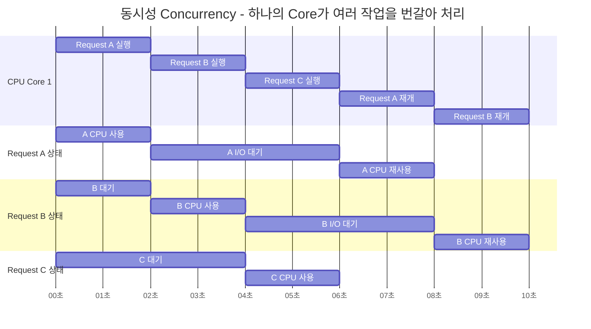

핵심은 다음과 같다.

> 동시성은 실제로 동시에 실행하는 것이 아니라, 여러 작업이 동시에 진행되는 것처럼 효율적으로 번갈아 처리하는 능력이다.

---

### 1.2 병렬성 Parallelism

병렬성은 **여러 작업이 실제로 같은 순간에 동시에 실행되는 것**이다.

병렬성은 CPU Core가 여러 개 있을 때 가능하다. 각 Core가 서로 다른 작업을 같은 시간 구간에 실행한다.

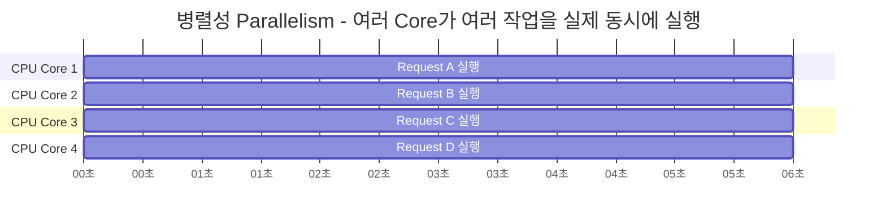

핵심은 다음과 같다.

> 병렬성은 여러 CPU Core가 여러 작업을 실제로 동시에 실행하는 능력이다.

---

### 1.3 동시성과 병렬성 비교

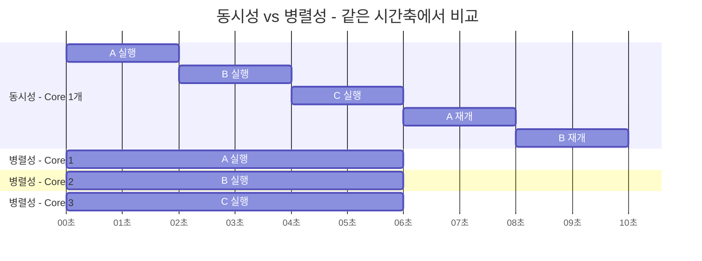

| 구분 | 핵심 질문 | 설명 |
|------|-----------|------|
| 동시성 | 여러 작업을 어떻게 겹쳐서 다룰 것인가? | 하나의 실행 자원으로도 대기 시간을 활용해 여러 작업을 번갈아 처리할 수 있다. |
| 병렬성 | 여러 작업을 실제로 동시에 실행할 수 있는가? | 여러 CPU Core가 있어야 실제 동시 실행이 가능하다. |

정리하면 다음과 같다.

> 동시성은 **작업을 다루는 구조**의 문제이고, 병렬성은 **실제 실행 자원**의 문제다.

---

### 1.4 비동기와 논블로킹

동시성 모델을 이해할 때 자주 나오는 개념이 비동기와 논블로킹이다.

| 개념 | 의미 |
|------|------|
| 비동기 Async | 작업 완료를 기다리지 않고, 완료되면 나중에 이어서 처리하는 방식 |
| 논블로킹 Non-blocking | 호출한 스레드나 이벤트 루프를 멈추지 않고 즉시 제어권을 반환하는 방식 |

둘은 비슷하게 쓰이지만 같은 말은 아니다.

예를 들어 `async/await`는 비동기 흐름을 표현하는 문법이다. 하지만 실제 I/O가 논블로킹으로 동작하려면 사용하는 DB driver, HTTP client, socket I/O도 non-blocking이어야 한다.

즉, `async`를 붙였다고 모든 코드가 자동으로 non-blocking이 되는 것은 아니다.

---

## 2. 백엔드 서버에서 중요한 두 가지 워크로드

동시성 모델을 비교할 때는 먼저 서버가 주로 어떤 작업을 하는지 구분해야 한다.

---

### 2.1 I/O-bound 작업

I/O-bound 작업은 CPU 연산보다 **기다리는 시간이 대부분인 작업**이다.

예시는 다음과 같다.

- DB 조회
- Redis 조회
- 외부 API 호출
- 파일 읽기/쓰기
- 네트워크 통신
- 메시지 브로커 publish/consume

이런 작업에서는 CPU가 계속 바쁜 것이 아니라 DB나 네트워크 응답을 기다리는 시간이 길다.

따라서 I/O-bound 서버에서는 다음이 중요하다.

> 기다리는 동안 스레드나 이벤트 루프를 얼마나 효율적으로 다른 작업에 넘길 수 있는가?

---

### 2.2 CPU-bound 작업

CPU-bound 작업은 실제 CPU 연산이 많은 작업이다.

예시는 다음과 같다.

- 이미지 처리
- 영상 처리
- 압축/해제
- 암호화
- FFT
- 대규모 JSON 직렬화/역직렬화
- 머신러닝 전처리/후처리
- CPU 기반 모델 추론

이런 작업은 기다리는 것이 아니라 실제로 CPU를 사용한다.

따라서 CPU-bound 작업에서는 다음이 중요하다.

> CPU Core 수만큼 병렬로 실행할 수 있는가?

중요한 점은 다음과 같다.

> Event Loop, Coroutine, Virtual Thread, Goroutine 같은 경량 동시성 모델은 I/O 대기에는 강하지만, CPU 연산을 마법처럼 빠르게 만들지는 않는다.

CPU-bound 작업은 결국 CPU Core 수, worker 수, process 수, GPU 사용 여부가 중요하다.

---

### 2.3 CPU-heavy 작업에 대한 공통 원칙

CPU-heavy 작업은 어떤 동시성 모델에서도 주의해야 한다. 다만 문제가 생기는 방식이 다르다.

| 실행 모델 | CPU-heavy 작업을 직접 실행하면 |
|-----------|-------------------------------|
| Thread-per-Request | 해당 요청 스레드가 오래 점유된다. 많아지면 request thread pool이 고갈된다. |
| Event Loop | 이벤트 루프 worker 전체가 막힌다. 같은 worker 안의 다른 요청까지 지연된다. |
| Go Goroutine | 여러 goroutine이 CPU를 두고 경쟁한다. 결국 CPU Core 수가 한계다. |
| Kotlin Coroutine | Dispatcher thread를 점유한다. 잘못 쓰면 dispatcher가 고갈된다. |
| Virtual Thread | CPU 작업 중에는 I/O 대기처럼 carrier thread를 반납하지 않는다. |

일반적인 원칙은 다음과 같다.

가벼운 CPU 작업은 짧고 제한적인 계산이라면 API 서버에서 직접 처리할 수 있다. 다만 요청 수가 많아지면 작은 CPU 작업도 누적되어 병목이 될 수 있다.

반면 이미지 처리, 영상 처리, 압축, FFT, ML 추론처럼 무겁거나 오래 걸리는 CPU/GPU 작업은 API 서버의 주 요청 경로에서 분리하는 것이 안전하다. 이때 사용할 수 있는 방식은 다음과 같다.

- 별도 worker
- process pool
- job queue
- Ray/Celery
- inference service
- GPU serving runtime

특히 Event Loop 기반 서버에서는 CPU-heavy 작업을 이벤트 루프 안에서 직접 실행하면 안 된다.

---

## 3. Thread-per-Request

> 대표 예시: Spring MVC + Tomcat, Django + Gunicorn sync worker, Rails

---

### 3.1 핵심 개념

Thread-per-Request는 요청 하나를 하나의 스레드가 처리하는 방식이다.

```
요청 1개 = 스레드 1개 배정
```

요청이 들어오면 스레드 풀에서 스레드 하나를 꺼내고, 그 스레드가 요청의 시작부터 끝까지 처리한다.

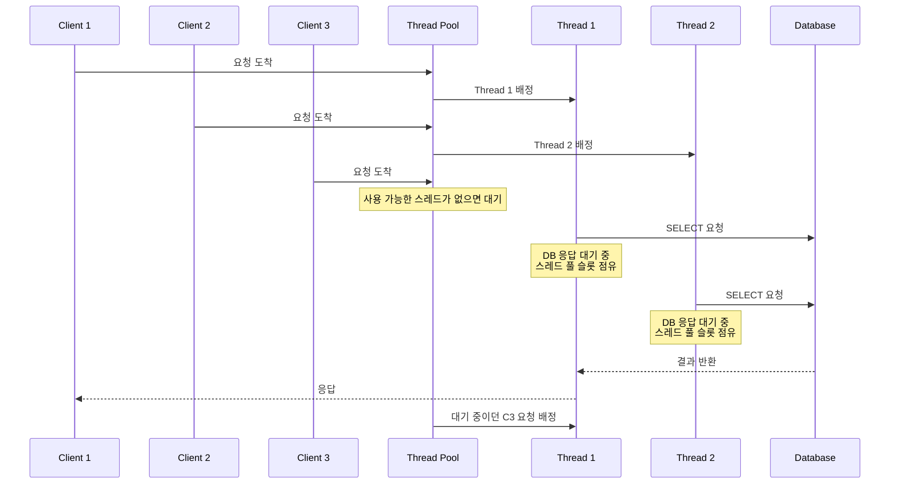

---

### 3.2 I/O-bound에서의 병목

Thread-per-Request에서 DB 응답을 기다리는 동안 CPU를 계속 사용하는 것은 아니다. 하지만 스레드는 다음 리소스를 점유한다.

- 스레드 풀의 한 자리
- 스레드 스택 메모리
- DB 커넥션
- 요청 컨텍스트
- 커널 스케줄링 대상

따라서 I/O 대기가 길고 동시 요청이 많아지면 CPU 사용률은 높지 않은데도 스레드 풀이 고갈되어 요청이 밀릴 수 있다.

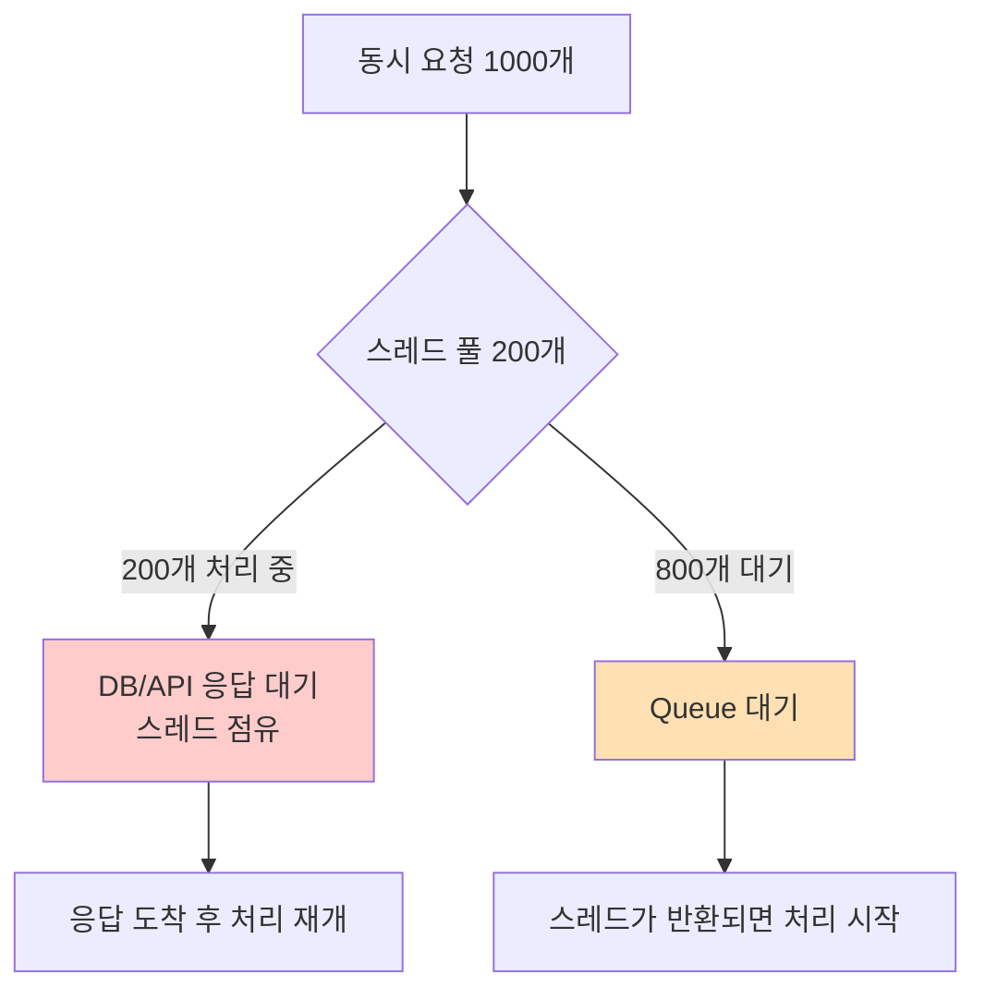

---

### 3.3 CPU-bound에는 유리한가?

Thread-per-Request는 Event Loop와 비교하면 CPU-bound 작업에 상대적으로 유리하다. 이유는 요청마다 별도 스레드가 있기 때문이다.

```
Thread 1 → Request A CPU 작업
Thread 2 → Request B 처리
Thread 3 → Request C 처리
Thread 4 → Request D 처리
```

Request A가 CPU 작업을 하더라도 Event Loop처럼 worker 전체가 즉시 멈추는 것은 아니다. 해당 요청을 처리하는 Thread 1이 점유될 뿐이고, 다른 스레드는 계속 다른 요청을 처리할 수 있다.

따라서 상대적으로 보면 다음과 같다.

| 구분 | CPU-bound 작업 직접 실행 시 |
|------|--------------------------|
| Event Loop | 이벤트 루프 worker 전체가 막힘 |
| Thread-per-Request | 해당 요청 스레드가 막힘 |

이 점 때문에 Thread-per-Request는 CPU-bound 작업에 상대적으로 유리한 실행 모델이라고 볼 수 있다.

하지만 한계도 명확하다. CPU-bound 작업은 결국 CPU Core를 사용한다. 예를 들어 8 Core 서버에서 CPU-heavy 요청 100개가 동시에 들어오면 실제로 동시에 빠르게 실행되는 작업은 대략 Core 수 근처다. 나머지 작업은 CPU 스케줄링을 기다리게 된다.

또한 CPU-heavy 요청이 request thread pool을 많이 점유하면 일반 API 요청도 사용할 수 있는 스레드가 없어 대기할 수 있다.

```
Thread Pool 200개
CPU-heavy 요청 200개 점유
일반 API 요청 도착
→ 사용 가능한 request thread 없음
→ 일반 API도 지연
```

따라서 결론은 다음과 같다.

> Thread-per-Request는 Event Loop보다 CPU-bound 작업에 상대적으로 유리하다. 하지만 무거운 CPU/GPU 작업을 request thread에서 오래 실행하면 thread pool 고갈이 발생할 수 있다.

즉, 짧고 제한적인 CPU 작업은 request thread에서 처리할 수 있지만, 이미지 처리, 영상 처리, ML 추론, 대용량 압축 같은 무거운 작업은 별도 worker/process/inference service로 분리하는 것이 안전하다.

---

### 3.4 장점

- 코드가 직관적이다.
- 위에서 아래로 순차 실행되므로 이해하기 쉽다.
- 디버깅이 상대적으로 쉽다.
- 기존 blocking 라이브러리와 호환성이 좋다.
- Event Loop보다 CPU-bound 작업에 상대적으로 안전하다.
- Java/Spring MVC 같은 성숙한 생태계와 잘 맞는다.

---

### 3.5 단점

- I/O 대기 중에도 스레드 풀 슬롯을 점유한다.
- 동시 요청 수가 스레드 풀 크기에 영향을 많이 받는다.
- 스레드 수를 무작정 늘리면 메모리와 컨텍스트 스위칭 부담이 커진다.
- 많은 동시 연결을 오래 유지하는 서비스에는 불리할 수 있다.
- CPU-heavy 작업이 많아지면 request thread pool이 잠식될 수 있다.

---

### 3.6 적합한 경우

- 팀이 동기식 코드에 익숙한 경우
- 요청 처리 흐름이 복잡하지만 순차적으로 표현하는 것이 중요한 경우
- blocking 라이브러리나 레거시 시스템과의 통합이 많은 경우
- 요청 처리 시간이 짧은 일반 API 서버
- 가벼운 CPU 작업이 포함된 API 서버
- 무거운 CPU/GPU 작업은 별도 worker로 분리할 수 있는 구조

---

## 4. Event Loop

> 대표 예시: Node.js, FastAPI/asyncio, Nginx, Netty, Spring WebFlux

---

### 4.1 핵심 개념

Event Loop는 하나의 루프가 여러 I/O 작업을 번갈아 처리하는 방식이다.

정확히는 보통 다음과 같이 이해하는 것이 좋다.

> 하나의 worker/process 안에서 이벤트 루프가 여러 비동기 작업을 처리한다.

서버 전체가 반드시 스레드 하나만 쓴다는 뜻은 아니다. 운영 환경에서는 worker process를 여러 개 띄워 멀티코어를 활용한다.

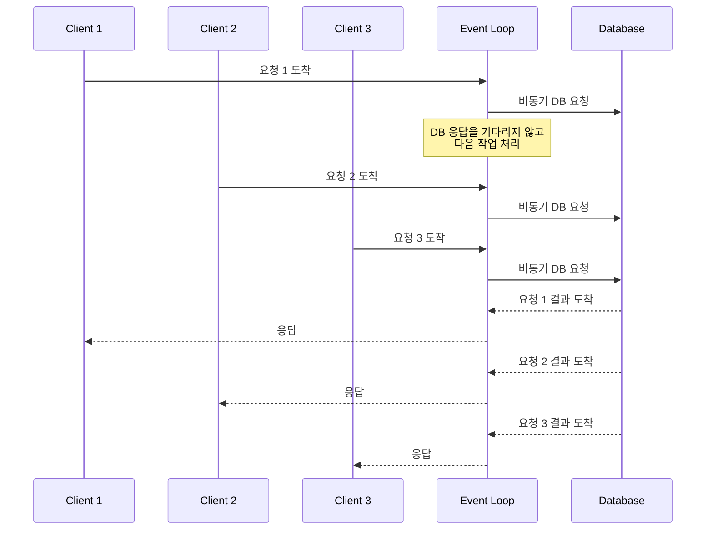

---

### 4.2 Event Loop가 잘 동작하는 조건

Event Loop가 성능을 내려면 중요한 조건이 있다.

> 이벤트 루프 안에서 오래 걸리는 blocking 작업을 하면 안 된다.

**잘 맞는 작업**

- async DB driver
- async Redis client
- async HTTP client
- non-blocking socket I/O
- WebSocket 연결 관리
- SSE
- API Gateway

**위험한 작업**

- CPU-heavy 연산
- 동기 blocking DB driver
- 동기 HTTP client
- 큰 파일을 동기 방식으로 읽고 쓰기
- `time.sleep()`
- 무거운 이미지/영상 처리
- ML 추론

---

### 4.3 CPU-bound 작업에 특히 취약한 이유

Event Loop는 CPU-heavy 작업에 특히 취약하다.

이유는 간단하다.

> CPU 작업 하나가 이벤트 루프를 점유하면, 같은 worker 안의 다른 요청까지 모두 밀린다.

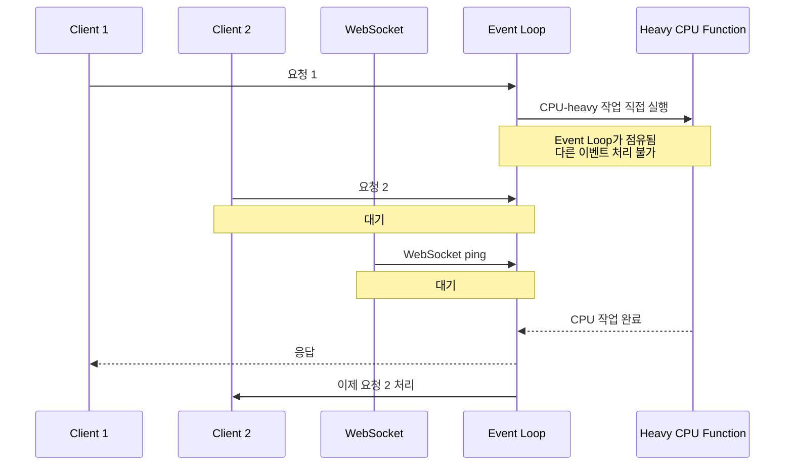

Thread-per-Request에서는 CPU 작업이 해당 요청 스레드를 막는다. 하지만 Event Loop에서는 CPU 작업이 event loop worker 전체를 막는다.

따라서 Event Loop 기반 서버에서는 CPU-heavy 작업을 별도 worker/process/inference service로 분리하는 것이 사실상 필수다.

---

### 4.4 멀티코어 활용

Event Loop는 보통 worker 하나당 하나의 이벤트 루프를 가진다. 따라서 멀티코어를 활용하려면 여러 worker를 띄운다.

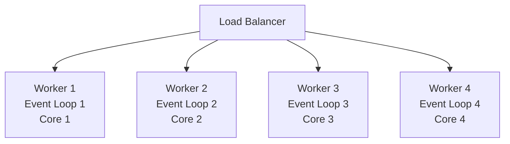

FastAPI를 예로 들면 다음과 같은 형태가 된다.

```bash
uvicorn app:app --workers 4
```

---

### 4.5 장점

- I/O 대기 시간이 많은 서버에 효율적이다.
- 적은 수의 worker로 많은 연결을 처리할 수 있다.
- WebSocket, SSE, 실시간 알림에 적합하다.
- API Gateway, BFF 구조에 잘 맞는다.
- 높은 동시 연결을 처리하기 좋다.

---

### 4.6 단점

- blocking 코드 하나가 event loop 전체를 막을 수 있다.
- CPU-heavy 작업에 취약하다.
- async/await가 호출 체인에 전파된다.
- 디버깅이 동기 코드보다 어려울 수 있다.
- 사용하는 라이브러리도 async/non-blocking인지 확인해야 한다.

---

### 4.7 적합한 경우

- DB/API 호출이 많은 I/O-bound API 서버
- WebSocket 기반 실시간 서비스
- 채팅, 알림, streaming response
- API Gateway, BFF
- Python/FastAPI, Node.js 기반 서비스
- CPU-heavy 작업을 별도 worker로 분리할 수 있는 구조

---

## 5. FastAPI를 사용할 때의 적용 규칙

FastAPI는 이벤트 루프 기반으로 동작할 수 있지만, 모든 코드가 자동으로 non-blocking이 되는 것은 아니다.

FastAPI에서는 크게 두 가지 endpoint 스타일이 있다.

---

### 5.1 `async def`

`async def`는 이벤트 루프 위에서 실행된다.

```python
@app.get("/users/{id}")
async def get_user(id: int):
    user = await async_db.fetch_user(id)
    return user
```

이 방식은 내부에서 `await` 가능한 non-blocking I/O를 사용할 때 적합하다.

예시는 다음과 같다.

- `asyncpg`
- `aiomysql`
- `httpx.AsyncClient`
- `aioredis`
- `aiofiles`

하지만 `async def` 안에서 blocking 함수를 직접 호출하면 이벤트 루프가 막힌다.

```python
# 좋지 않은 예
@app.get("/bad")
async def bad():
    result = heavy_cpu_work()
    return result
```

---

### 5.2 일반 `def`

FastAPI에서 일반 `def` endpoint는 threadpool에서 실행된다.

```python
@app.get("/legacy-users/{id}")
def get_legacy_user(id: int):
    user = blocking_db.fetch_user(id)
    return user
```

따라서 blocking 라이브러리를 사용해야 한다면 무조건 `async def`로 감싸는 것보다, 일반 `def`를 사용하는 편이 더 안전할 수 있다.

단, 일반 `def`로 작성한 endpoint도 무한정 안전한 것은 아니다. threadpool 크기에는 한계가 있으므로, 오래 걸리는 CPU-heavy 작업을 일반 `def` endpoint에서 계속 처리하면 threadpool이 고갈될 수 있다.

---

### 5.3 FastAPI에서 blocking 작업과 CPU 작업 처리

CPU-heavy 작업은 API 이벤트 루프 안에서 직접 처리하지 않는 것이 좋다.

```python
# 좋지 않은 예
@app.post("/predict")
async def predict(data: InputData):
    result = heavy_ml_inference(data)
    return result
```

blocking I/O나 짧은 blocking 작업은 threadpool로 보낼 수 있다.

```python
@app.post("/process")
async def process(data: InputData):
    result = await asyncio.to_thread(blocking_function, data)
    return result
```

하지만 순수 Python CPU-bound 작업은 threadpool로 보내도 GIL과 CPU Core 한계 때문에 처리량이 크게 늘지 않을 수 있다. 이런 작업은 ProcessPool, Ray, Celery, 별도 inference service로 분리하는 편이 더 적합하다.

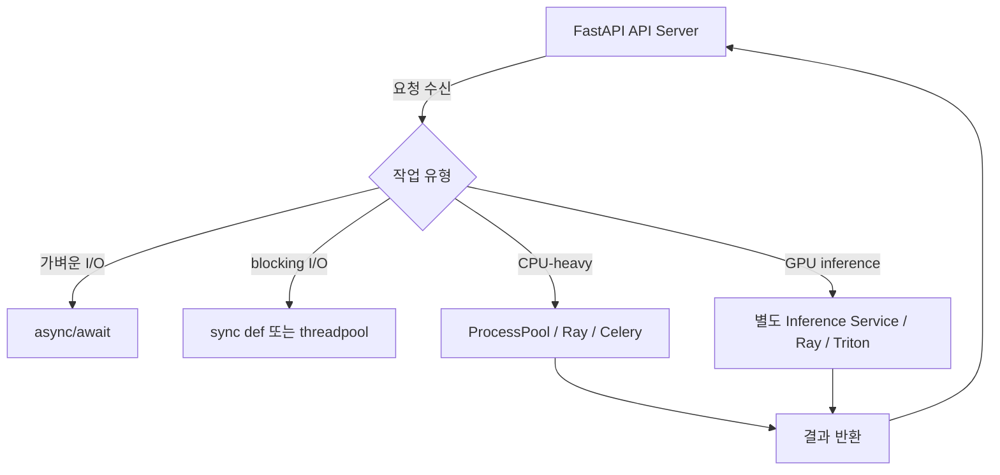

---

### 5.4 FastAPI worker와 상태 관리

FastAPI를 여러 worker로 실행하면 각 worker는 별도 프로세스다.

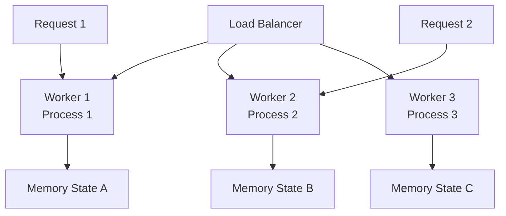

첫 번째 요청은 worker 1로 가고, 두 번째 요청은 worker 2로 갈 수 있다. 이 경우 worker 1의 메모리에 저장된 상태를 worker 2는 알 수 없다.

따라서 다음 기준을 사용할 수 있다.

- 정합성이 중요한 상태: Redis, DB, 외부 state store에 저장
- 단순 캐시: worker local memory 허용 가능
- 요청 중 임시 상태: local variable 사용 가능
- 장기 세션 상태: Redis/DB 권장

중요한 점은 이것이다.

> Stateless라는 말은 메모리를 전혀 쓰지 말라는 뜻이 아니다. 여러 worker가 공유해야 하는 중요한 상태를 특정 worker 메모리에만 두지 말라는 뜻이다.

---

## 6. Go Goroutine

> 대표 예시: Go net/http, Gin, Echo, Fiber

---

### 6.1 핵심 개념

Go는 goroutine이라는 경량 실행 단위를 제공한다.

goroutine은 OS thread가 아니다. 하지만 OS thread 없이 실행되는 것도 아니다.

정확히는 다음과 같다.

> Go runtime scheduler가 많은 goroutine을 적은 수의 OS thread 위에 배치해서 실행한다.

이것을 흔히 M:N 스케줄링이라고 한다.

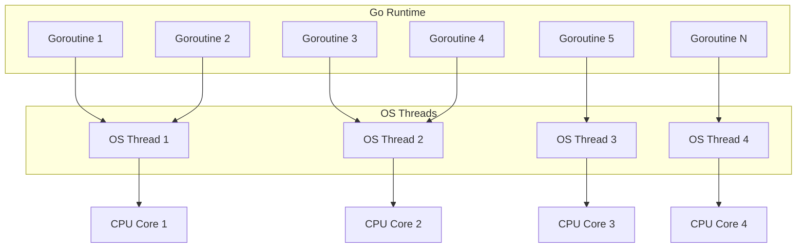

goroutine이 가볍다고 해서 무제한으로 생성해도 된다는 뜻은 아니다. 요청 수, DB connection pool, 외부 API 처리량, channel 대기 상태를 고려하지 않으면 goroutine leak이나 backpressure 문제가 생길 수 있다.

---

### 6.2 Go 코드의 특징

Go는 async/await 없이도 동기 코드처럼 작성한다.

```go
func handleRequest(w http.ResponseWriter, r *http.Request) {
    result, err := db.Query("SELECT ...")
    if err != nil {
        http.Error(w, err.Error(), 500)
        return
    }

    json.NewEncoder(w).Encode(result)
}
```

겉으로는 blocking 코드처럼 보이지만, Go runtime은 네트워크 I/O 대기 중인 goroutine을 적절히 스케줄링한다.

---

### 6.3 CPU-bound 관점

Go goroutine은 CPU-bound 작업도 병렬로 실행할 수 있다. Go는 Python의 GIL 같은 제약이 없고, 여러 OS thread를 통해 멀티코어를 활용할 수 있다.

하지만 CPU-bound 작업도 결국 CPU Core 수가 한계다.

goroutine을 많이 만든다고 CPU 작업 처리량이 무제한으로 늘어나지는 않는다. 무거운 CPU 작업이 많다면 worker pool, queue, backpressure, rate limit이 필요하다.

---

### 6.4 장점

- 생성 비용이 작다.
- 코드가 동기식처럼 읽힌다.
- async/await 전파가 없다.
- 멀티코어 병렬 실행이 가능하다.
- 네트워크 서버 구현에 강하다.
- 단일 바이너리 배포가 쉽다.

---

### 6.5 주의할 점

- goroutine leak이 발생할 수 있다.
- channel을 잘못 사용하면 deadlock이 생길 수 있다.
- 공유 메모리 접근 시 race condition이 발생할 수 있다.
- CPU-bound 작업은 결국 CPU Core 수가 한계다.
- DB connection pool, 외부 API 한계는 그대로 존재한다.

---

### 6.6 적합한 경우

- 고성능 API 서버
- 네트워크 서버
- 메시지 처리 서비스
- 마이크로서비스
- edge 환경에서 단일 바이너리 배포가 중요한 경우
- I/O와 가벼운 CPU 작업이 섞인 서비스

---

## 7. Kotlin Coroutine

> 대표 예시: Ktor, Spring WebFlux + Kotlin Coroutine

---

### 7.1 핵심 개념

Kotlin coroutine은 suspend/resume 가능한 경량 실행 흐름이다.

어떤 작업이 I/O를 기다려야 할 때 스레드를 계속 점유하지 않고, 중단되었다가 나중에 다시 이어서 실행될 수 있다.

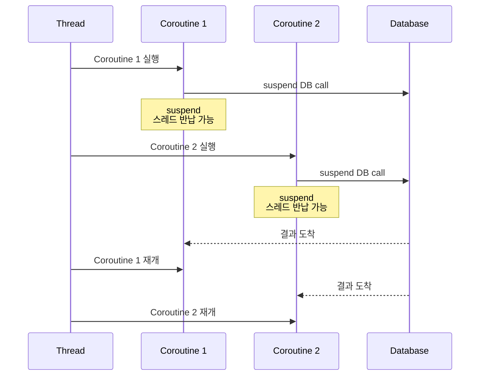

---

### 7.2 중요한 오해

`suspend`를 붙인다고 내부 코드가 자동으로 non-blocking이 되는 것은 아니다.

```kotlin
suspend fun badExample() {
    Thread.sleep(1000) // 실제 스레드를 막음
}
```

`suspend` 함수 안에서도 blocking 코드를 호출하면 실제 스레드는 점유된다.

따라서 다음이 중요하다.

- non-blocking DB driver 사용
- non-blocking HTTP client 사용
- blocking 작업은 `Dispatchers.IO`로 분리
- CPU 작업은 `Dispatchers.Default` 또는 별도 worker로 분리

---

### 7.3 구조적 동시성

Kotlin coroutine의 큰 장점 중 하나는 구조적 동시성이다.

```kotlin
suspend fun getDashboard(userId: Long) = coroutineScope {
    val user = async { userService.findById(userId) }
    val orders = async { orderService.findByUserId(userId) }
    val profile = async { profileService.getProfile(userId) }

    Dashboard(
        user = user.await(),
        orders = orders.await(),
        profile = profile.await()
    )
}
```

여러 I/O 작업을 동시에 실행하고, 하나의 scope 안에서 생명주기를 관리할 수 있다.

---

### 7.4 장점

- JVM 생태계를 그대로 활용할 수 있다.
- async/await보다 구조적인 동시성 표현이 좋다.
- 여러 I/O 작업을 동시에 실행하고 조합하기 쉽다.
- Ktor, Spring WebFlux와 잘 어울린다.
- Android에서는 사실상 표준에 가깝다.

---

### 7.5 단점

- suspend 함수가 호출 체인에 전파된다.
- Dispatcher, Scope, Job 개념을 이해해야 한다.
- blocking 라이브러리를 섞으면 성능 이점이 줄어든다.
- CPU-heavy 작업은 적절한 dispatcher나 worker로 분리해야 한다.
- 기존 Spring MVC 스타일 팀에게는 학습 비용이 있다.

---

### 7.6 적합한 경우

- Kotlin 기반 신규 백엔드
- Spring WebFlux 또는 Ktor 사용
- 여러 I/O를 동시에 조합해야 하는 서비스
- JVM 생태계를 유지하면서 비동기 모델을 쓰고 싶은 경우

---

## 8. Java Virtual Threads

> 대표 예시: Java 21+, Spring Boot 3.2+ 환경의 Spring MVC

---

### 8.1 핵심 개념

Virtual Thread는 JVM이 관리하는 경량 스레드다.

기존 platform thread는 OS thread와 거의 직접 연결된다. 반면 virtual thread는 JVM이 관리하고, 실제 실행이 필요할 때 carrier thread에 올라가 실행된다.

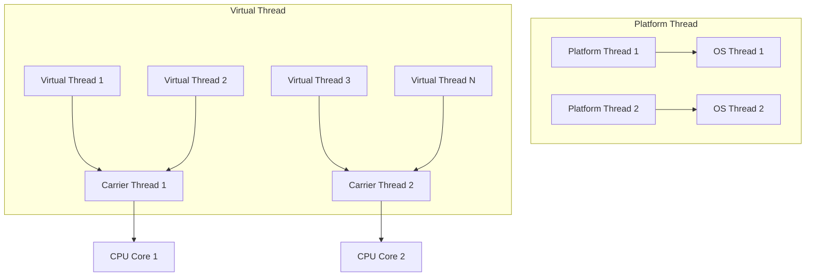

---

### 8.2 Virtual Thread가 해결하는 문제

기존 Thread-per-Request에서는 요청이 DB 응답을 기다리는 동안 platform thread를 점유했다.

Virtual Thread는 많은 blocking I/O 상황에서 대기 중인 virtual thread를 carrier thread에서 내려놓을 수 있다.

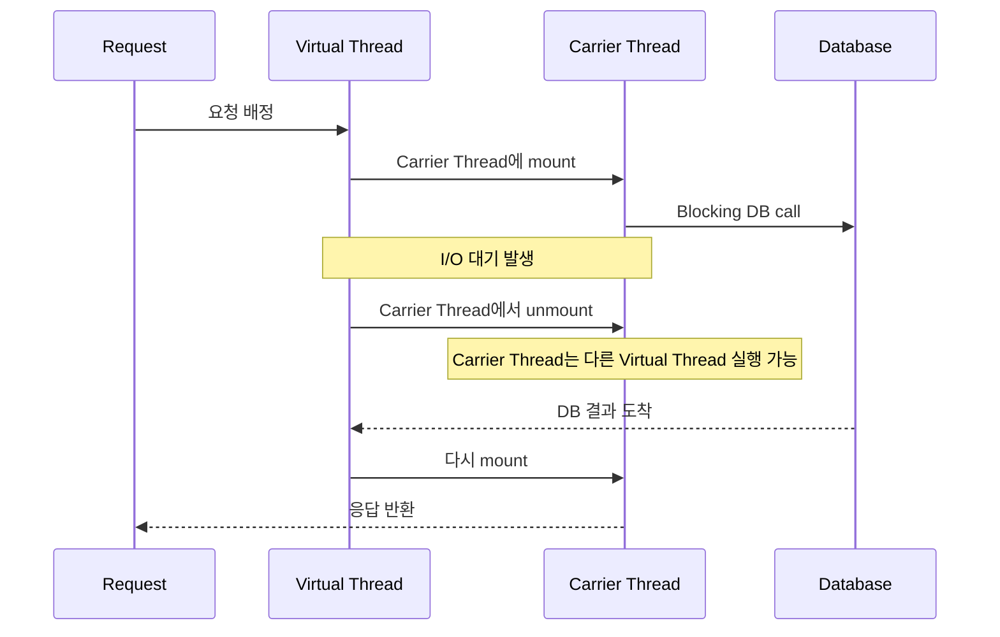

---

### 8.3 Spring Boot에서의 사용 예

```yaml
spring:
  threads:
    virtual:
      enabled: true
```

기존 Spring MVC 스타일 코드는 크게 바꾸지 않아도 된다.

```java
@RestController
public class UserController {

    @GetMapping("/users/{id}")
    public User getUser(@PathVariable Long id) {
        User user = userRepository.findById(id);
        Profile profile = profileClient.getProfile(id);
        return user.withProfile(profile);
    }
}
```

---

### 8.4 CPU-bound 관점

Virtual Thread는 I/O-bound 작업에 특히 유리하다.

하지만 CPU-bound 작업에서는 I/O 대기처럼 carrier thread를 반납하지 않는다. CPU 작업을 하는 동안에는 실제 carrier thread와 CPU Core를 계속 사용한다.

따라서 Virtual Thread를 사용한다고 CPU-heavy 작업 처리량이 자동으로 늘어나지는 않는다.

무거운 CPU/GPU 작업은 Thread-per-Request와 마찬가지로 별도 worker, process pool, inference service로 분리하는 것이 안전하다.

---

### 8.5 중요한 주의사항

Virtual Thread는 매우 유용하지만 모든 문제를 해결하지는 않는다.

- CPU-bound 작업을 빠르게 만들어주는 기술은 아니다.
- DB connection pool 크기 제한은 그대로 존재한다.
- 외부 API, downstream 서비스의 처리량 한계도 그대로 존재한다.
- Java 버전과 코드 패턴에 따라 carrier thread pinning을 주의해야 한다.
- 특히 Java 21 환경에서는 `synchronized` 블록/메서드 안에서 오래 걸리는 blocking I/O를 수행하면 pinning으로 확장성이 떨어질 수 있다.
- native call, foreign function, 일부 라이브러리 사용 시에도 pinning 여부를 확인하는 것이 좋다.

즉, Virtual Thread의 핵심 장점은 다음이다.

> 기존 동기식 Thread-per-Request 모델을 유지하면서 I/O 대기 중 platform thread 점유를 줄이는 것

---

### 8.6 장점

- 기존 동기식 코드 스타일을 유지할 수 있다.
- async/await를 도입하지 않아도 된다.
- Spring MVC와 잘 어울린다.
- I/O-bound API 서버의 동시성 개선에 유리하다.
- stack trace와 디버깅 모델이 상대적으로 친숙하다.

---

### 8.7 단점

- Java 21 이상 환경이 필요하다.
- 일부 라이브러리나 코드 패턴에서 pinning 이슈를 주의해야 한다.
- CPU-bound 작업에는 큰 이점이 없다.
- connection pool, rate limit, downstream 병목은 별도 설계가 필요하다.

---

### 8.8 적합한 경우

- 기존 Spring MVC 프로젝트
- Java 21 이상 사용 가능
- 팀이 async/reactive 패러다임에 익숙하지 않은 경우
- I/O-bound API 서버
- 기존 blocking 라이브러리를 많이 사용하는 서비스

---

## 9. 종합 비교

### 9.1 실행 모델 비교


---

### 9.2 비교표

| 항목 | Thread-per-Request | Event Loop | Go Goroutine | Kotlin Coroutine | Java Virtual Thread |
|------|-------------------|------------|--------------|------------------|---------------------|
| 대표 환경 | Spring MVC, Django sync | Node.js, FastAPI async, Netty | Go | Kotlin, Ktor, WebFlux | Java 21+, Spring MVC |
| 코드 스타일 | 동기식 | async/await | 동기식에 가까움 | suspend | 동기식 |
| 동시성 단위 | OS/Platform Thread | Event/Task | Goroutine | Coroutine | Virtual Thread |
| I/O 대기 처리 | 스레드 점유 | 루프 반납 | 런타임 스케줄러가 처리 | suspend/resume | carrier thread 반납 가능 |
| 멀티코어 활용 | 가능 | worker 여러 개 필요 | 가능 | dispatcher에 따라 가능 | 가능 |
| CPU-bound | Event Loop보다 상대적으로 유리 | 루프에서 직접 처리 금지 | 가능하지만 Core 수가 한계 | dispatcher 분리 필요 | 이점 적음, 별도 분리 권장 |
| 학습 난이도 | 낮음 | 중간 | 낮음~중간 | 중간~높음 | 낮음~중간 |
| 주요 주의점 | 스레드 풀 고갈 | blocking 코드 금지 | goroutine leak, race | blocking 코드 주의 | pinning, pool 병목 |

> Virtual Thread도 CPU 작업을 실제로 실행할 때는 carrier thread와 CPU Core를 사용한다. 따라서 I/O 대기에는 유리하지만, CPU-bound 작업 처리량이 자동으로 늘어나는 것은 아니다.

---

## 10. 어떤 상황에서 무엇을 검토할까?

아래 흐름은 절대적인 정답이 아니라, 기술 선택 시 참고할 수 있는 기준에 가깝다.

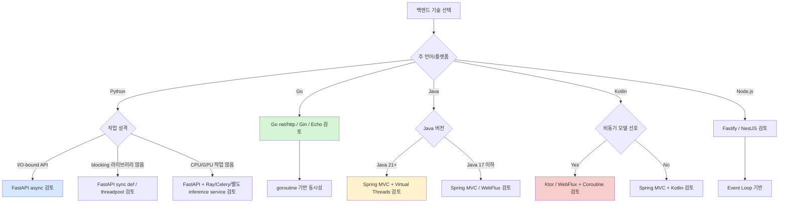

---

## 11. FastAPI 기반 서버 설계 시 적용 규칙

FastAPI 기반 API 서버를 설계할 때 가장 중요한 원칙은 다음이다.

> FastAPI API 서버는 요청 수신, 인증, 검증, 가벼운 I/O, orchestration에 집중하는 것이 좋다. CPU/GPU-heavy 작업은 API 이벤트 루프에서 직접 처리하지 않는 것이 안전하다.

---

### 11.1 권장 구조

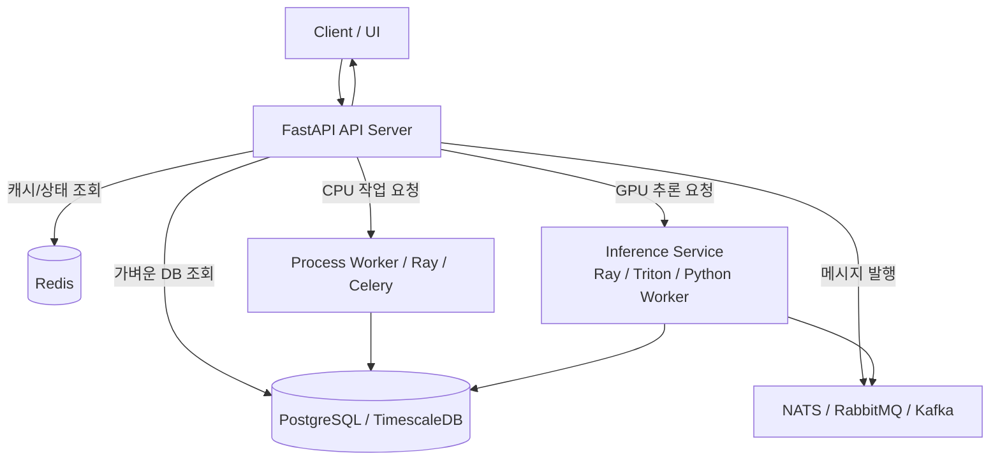

---

### 11.2 FastAPI 코딩 규칙

1. `async def` 안에서는 `await` 가능한 non-blocking I/O만 직접 호출한다.
2. blocking DB driver, blocking SDK, blocking HTTP client를 `async def` 안에서 직접 호출하지 않는다.
3. blocking 라이브러리를 써야 한다면 `sync def` endpoint, threadpool, 별도 worker 중 하나를 선택한다.
4. 이미지 처리, 영상 처리, FFT, 압축, ML 추론 같은 CPU/GPU-heavy 작업은 API 서버에서 직접 실행하지 않는다.
5. CPU-heavy 작업은 ProcessPool, Ray, Celery, 별도 worker로 분리한다.
6. GPU inference는 별도 inference service 또는 Ray/Triton/Python worker로 분리한다.
7. 여러 worker가 공유해야 하는 상태는 worker 메모리에만 저장하지 않는다.
8. 정합성이 중요한 상태는 Redis, DB, 외부 state store에 둔다.
9. 단순 local cache는 허용 가능하지만, cache miss나 worker 변경을 감안해야 한다.
10. 성능 테스트 시 평균 응답시간뿐 아니라 p95/p99 latency, event loop blocking, worker별 CPU 사용률을 확인한다.

---

### 11.3 좋지 않은 예

```python
@app.post("/predict")
async def predict(data: InputData):
    # CPU-heavy 또는 GPU inference를 API 이벤트 루프 안에서 직접 실행
    result = model.predict(data)
    return result
```

문제점은 다음과 같다.

- 이벤트 루프가 막힐 수 있다.
- 같은 worker의 다른 요청도 지연된다.
- 요청 수가 늘면 p95/p99 latency가 급격히 나빠질 수 있다.

---

### 11.4 더 나은 예

```python
@app.post("/predict")
async def predict(data: InputData):
    # API 서버는 추론 작업을 별도 worker/service에 위임
    result = await inference_client.predict(data)
    return result
```

또는 단순 blocking 작업이면 다음처럼 분리할 수 있다.

```python
@app.post("/process")
async def process(data: InputData):
    result = await asyncio.to_thread(blocking_function, data)
    return result
```

---

## 12. 결론

동시성 모델을 이해한다는 것은 단순히 `async/await`, `goroutine`, `suspend`, `virtual thread` 문법을 아는 것이 아니다.

중요한 질문은 다음이다.

1. 서버의 병목은 I/O 대기인가, CPU/GPU 연산인가?
2. 요청 하나가 대기 중일 때 실행 자원을 점유하는가?
3. CPU-heavy 작업이 들어왔을 때 어떤 범위까지 영향을 주는가?
4. 멀티코어를 어떻게 활용하는가?
5. blocking 코드가 event loop나 worker 전체를 막지는 않는가?
6. worker를 여러 개 띄웠을 때 상태 관리는 안전한가?
7. DB connection pool, 외부 API, message broker 같은 downstream 병목은 고려했는가?

정리하면 다음과 같다.

| 패러다임 | 핵심 요약 |
|---------|-----------|
| Thread-per-Request | 이해하기 쉽고 CPU-bound에 상대적으로 유리하지만, I/O 대기 중 스레드 풀 슬롯을 점유한다. |
| Event Loop | I/O-bound에 강하지만 blocking 코드나 CPU 작업 하나가 루프를 막을 수 있다. |
| Go Goroutine | 동기식 코드 스타일과 경량 동시성을 잘 결합했다. |
| Kotlin Coroutine | JVM 생태계에서 구조적 비동기 코드를 작성하기 좋다. |
| Java Virtual Thread | 기존 동기식 Java 코드를 유지하면서 I/O 동시성을 높이기 좋다. |

최종적으로 중요한 것은 특정 패러다임이 무조건 좋다는 것이 아니다.

> 프로젝트의 언어, 프레임워크, 라이브러리, 워크로드, 운영 환경에 맞는 동시성 모델을 선택하고, 그 모델의 한계를 알고 구현하는 것이 중요하다.

특히 FastAPI 기반 서버에서는 다음 원칙이 중요하다.

> API 서버는 이벤트 루프를 막지 않게 설계하고, CPU/GPU-heavy 작업은 별도 worker나 inference service로 분리한다.
